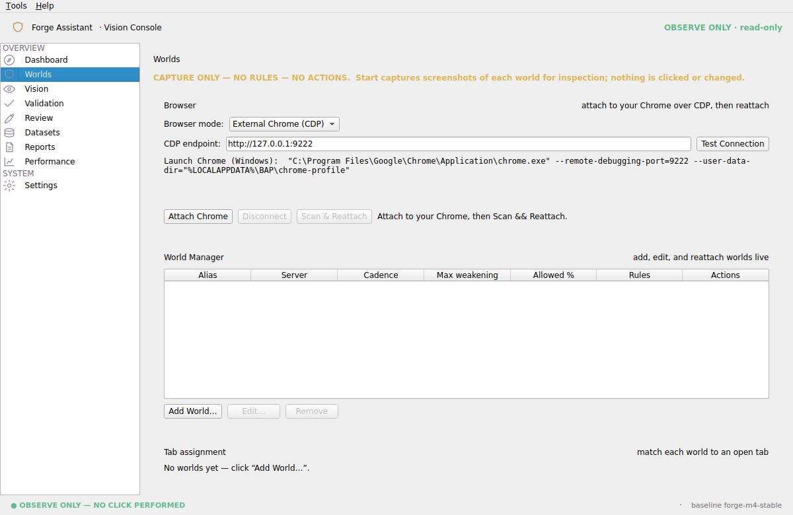
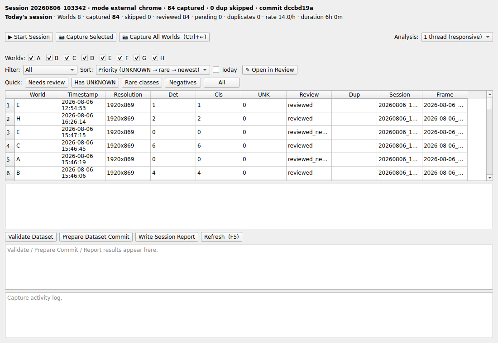

# Forge Assistant — Contributor Quick Start

Welcome! You are going to help collect **screenshots of battle badges** from your
own Forge of Empires worlds. The app only **looks** at your game — it never clicks,
plays, or changes anything. Your job: capture frames, tell it which badge is which,
and upload. You can be collecting in **under 30 minutes**.

You need (already installed for you): **Windows 11**, **Python 3.11+**, **Git**, and
**Google Chrome**. Radek also has to **add you as a collaborator** on the project so
your uploads are accepted — ask him to confirm he's done that.

---

## Step 1 — Get the project (one time)

Press `Win`, type **Git Bash**, open it, and paste this single line (right-click =
paste in Git Bash), then press Enter:

```bash
git clone -b claude/browser-automation-architecture-5784h1 https://github.com/Dirtystar/foe.git
```

This downloads everything into a folder called **`foe`** inside your user folder
(e.g. `C:\Users\YourName\foe`). Open it in File Explorer and go into this sub-folder
— **this `Marek` folder is your home base**:

```
foe  ▸  browser_automation_platform  ▸  Marek
```

**Everything from here is done by double-clicking the numbered files in the `Marek`
folder, in order.** You will not need the command line again.

> If Windows shows a blue "Windows protected your PC" box when you double-click,
> click **More info → Run anyway** — these are local helper scripts, not downloads.

---

## Step 2 — Install (one time)

Double-click **`1 - Install.bat`**.

It builds a private workspace and downloads the app's libraries (2–4 minutes the
first time). When it says **"DONE. Install finished successfully."**, close the
window. You never have to do this again unless Radek says so.

---

## Step 3 — Each time you collect

Do these three double-clicks **in order**:

| Double-click | What happens |
|---|---|
| **`2 - Update.bat`** | Grabs the latest version. Wait for "You are on the latest version." |
| **`3 - Start Chrome.bat`** | Opens a **dedicated** Chrome. **Log into Forge and open your World tabs here.** (Your normal Chrome is untouched.) |
| **`4 - Run.bat`** | Opens the Forge Assistant app. |

The app opens on a dashboard that always says **OBSERVE ONLY — NO CLICK PERFORMED**.
That banner is your guarantee: it is watching, not playing.

### First run only: point the app at your Chrome

On the left, click **Worlds**. Set **Browser mode** to **External Chrome (CDP)**.
The app will say *"Restart BAP to use External Chrome"* — that's normal:
**close the app and double-click `4 - Run.bat` again.** Now the Worlds page looks
like this, with an **Attach Chrome** button:



Click **Test Connection** (should go green), then **Attach Chrome**, then
**Scan && Reattach**. Your worlds now show as attached. You only configure this once
— the app remembers it.

---

## Step 4 — Collect data

Open **Tools ▸ Live Data Collection…**. This window is your workbench:



1. Click **Start Session**.
2. Click **Capture All Worlds** (or press **`Ctrl`+`Enter`**). It screenshots every
   world in the background — the window stays responsive.
3. **Move around the battle map** in Chrome (attack different provinces so new
   badges appear), then capture again. Repeat through the day.

The line at the top shows how many frames you've captured. Grab the **rare** badges
whenever you see them — **red 80% badges are the most valuable**, then 40% and 100%.

---

## Step 5 — Review (tell it which badge is which)

Pick a row in the list and click **Open in Review** (or double-click the row). A
picture of that frame opens. For each badge the app found:

| Key | Meaning |
|---|---|
| `1` `2` `3` `4` `5` | this badge is **20 / 40 / 60 / 80 / 100 %** |
| `Delete` | this box is **not** a badge (remove it) |
| `N` | this whole frame has **no** badges (a clean map) |
| `Enter` | **Save and go to the next frame** |
| `←` / `→` | previous / next frame |

A green **REVIEWED** pill confirms it's saved. **If you're not sure of a number,
skip it** — leaving it blank is always safe. That's the whole job: capture, then
press number keys.

---

## Step 6 — Validate & upload

1. In the Live Data Collection window, click **Validate Dataset**. It just *reports*
   — if it lists problems, tell Radek; it never breaks anything.
2. **Close the app.**
3. Double-click **`5 - Push.bat`**. It packages only your new data and uploads it. The
   **first** upload opens a browser window asking you to sign in to GitHub — do that
   once and it's remembered. When it says **"Your data is uploaded. Thank you!"**,
   you're done.

Chrome can stay open for next time. That's the entire loop:
**2 - Update → 3 - Start Chrome → 4 - Run → collect → review → validate → 5 - Push.**

> There's also a **`6 - Collect Frames.bat`** in the folder. You don't normally need it —
> `5 - Push.bat` already includes everything. It's just a way to *see* how much you've
> collected. It's read-only and safe: it never plays the game and never deletes anything.

---

## If something looks wrong

| You see… | Do this |
|---|---|
| `1 - Install.bat`: "Python was not found" | Reinstall Python from python.org and **tick "Add python.exe to PATH"**, then run `1 - Install.bat` again. |
| `3 - Start Chrome.bat`: "Could not find Google Chrome" | Chrome is installed somewhere unusual — send Radek a message. |
| **Test Connection** stays red | Make sure you opened Chrome with **`3 - Start Chrome.bat`** (not your normal Chrome), and that it's still open. |
| Worlds won't attach | In that dedicated Chrome, make sure you're **logged into Forge** with the world tabs open, then click **Scan && Reattach**. |
| `5 - Push.bat`: "Nothing new to send" | You haven't captured/reviewed anything yet, or already uploaded. Capture some frames first. |
| `5 - Push.bat`: "Upload failed" | Check your internet and run **`5 - Push.bat`** again — your work is saved on your PC and nothing is lost. |
| The app won't open / shows red text | Screenshot the black window and send it to Radek. Nothing is harmed. |
| Anything else | Take a screenshot and ask Radek. You cannot break the game or the project. |

_The app is strictly read-only: no clicking, no cursor movement, no automation. The
worst that can happen is a frame you're unsure about — and "skip it" is always the
right answer._
