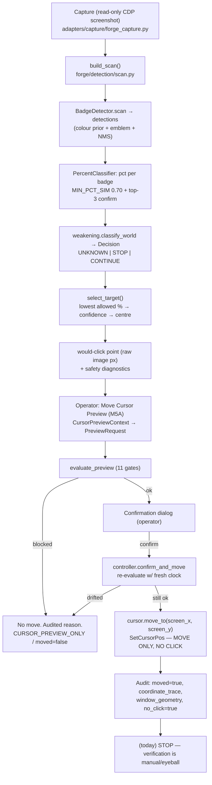
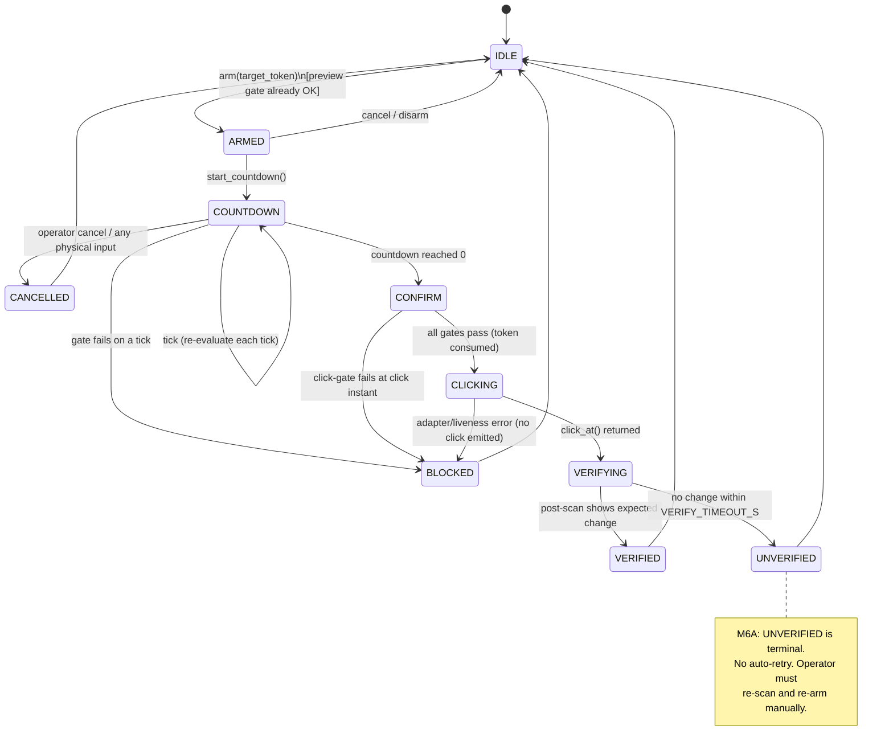
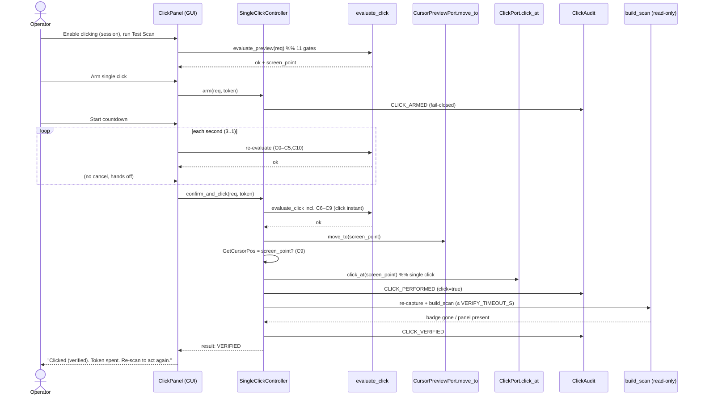
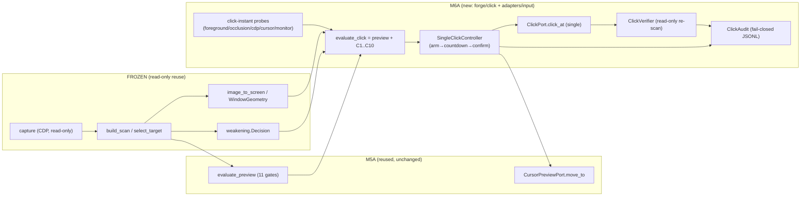

# M6 — Autonomous Clicking: Engineering Design Review

_Status: **DESIGN ONLY**. No production code, behaviour, AI, detector, classifier,
OCR, benchmark, cursor-movement, or clicking change is made by this document. It
specifies the next milestone so it can be built safely later. Every "new" module
below is a **proposal**, not an implementation._

> **Safety stance carried forward.** The product is observe-only today, with one
> gated manual output — the M5A **Move Cursor Preview** (`move_to` only, never a
> click). M6 introduces the *first click*. The whole design is built so that the
> click inherits — verbatim — the existing 11-condition manual gate, the
> confirm→re-evaluate→act-once→audit controller shape, and the append-only audit
> trail, and adds click-specific verification on top. **Nothing loosens an existing
> gate.**

---

## 0. How to read this document

- **§1** maps the *current* architecture and the exact Capture→…→Verification flow.
- **§2** is the full failure-mode table (consequence / current / missing / handling).
- **§3** is the clicking pipeline: state machine, gating, countdown, cancellation,
  verification, retry, timeout, audit.
- **§4** recovery flows. **§5** human factors (UI recommendations only). **§6** test
  strategy. **§7** technical debt that would make clicking hard.
- **§8** component specifications (implementation-ready), the **M6A** definition,
  and the four closing checklists.

Diagrams are Mermaid (render on GitHub). File paths are `browser_automation_platform/…`.

---

## 1. Current architecture review

### 1.1 Component inventory (as built today)

| Concern | Module(s) | Role | Frozen for M6? |
|---|---|---|---|
| Capture | `adapters/capture/forge_capture.py` | read-only CDP `Page.captureScreenshot` (`fromSurface`, no input) | **Yes** — reuse read-only |
| Detector | `forge/detection/detector.py` (`BadgeDetector`) | colour prior + emblem template + NMS → `Detection{center,kind,pct}` | **Yes — do not modify** |
| Classifier | `forge/detection/classify.py` (`PercentClassifier`) | OCR-free crop-cosine 1-NN, `MIN_PCT_SIM=0.70` + top-3 confirm | **Yes — do not modify** |
| Scan pipeline | `forge/detection/scan.py` (`build_scan`, `select_target`) | detections → chosen target + would-click point; safety diagnostics | **Reuse read-only**; do not change selection/thresholds |
| Weakening gate | `forge/detection/weakening.py` (`Decision`) | UNKNOWN→no action, ≥limit→STOP, confident-below→CONTINUE | **Yes — do not modify** |
| Geometry / coord contract | `forge/cursor/geometry.py` (`WindowGeometry`, `image_to_screen`, `CoordinateTrace`, `point_in_capture`) | raw image px → viewport CSS → **physical** screen px; `identity()` drift key | **Reuse read-only** |
| Calibration | `forge/cursor/window_geometry.py` (`ContentOriginCalibration`, `CalibrationKey`) | operator content-origin calibration keyed by geometry | **Reuse read-only** |
| Cursor preview (M5A) | `forge/cursor/{port,preview,controller,context,audit}.py` | 11-gate → confirm → **move once** → audit; movement-only port | **Reuse; extend by parallel, never widen the port** |
| Cursor adapter | `adapters/cursor/{os_cursor,fake_cursor}.py` | Win32 `SetCursorPos` (physical px); fake for tests | **Do not add input methods** |
| Review mode | `gui/forge_review.py`, `forge/labeling/` | operator labels/corrects frames → ground truth | **Frozen (workflow)** |
| Live collection | `forge/collection/*`, `gui/forge_collection.py` | bounded background capture → dataset | **Frozen (workflow)** |
| Audit logging | `forge/cursor/audit.py` (`CursorPreviewAudit`, JSONL, `no_click=true`) | append-only, line-atomic trail | **Reuse pattern; new file for clicks** |
| Scheduler | **none for Forge** | Test Scan is synchronous; Capture All is a bounded one-shot background job; generic `app/supervisor.py` tick loop is **not** wired to Forge acting | n/a — M6A adds **no** scheduler |
| State management | GUI-owned, per-session; `CursorPreviewController._enabled` (disabled every launch, never persisted); `ops/status.py` operational state | session-scoped, fail-safe defaults | **Reuse pattern** |

### 1.2 The existing manual gate (the spine M6 reuses)

`forge/cursor/preview.py::evaluate_preview` checks **11 conditions in a fixed,
safety-first order**, returning the exact blocking `code`+`reason` on first failure:

1. `disabled` — session enable flag off (defaults off every launch)
2. `no_window` — no owned/attached browser (`managed_chromium`|`external_chrome`)
3. `not_live` — target not from a fresh live scan
4. `world_switched` — selected World ≠ scanned World
5. `tab_changed` — World's tab id changed since the scan
6. `no_target` — no target badge
7. `unknown_pct` — pct UNKNOWN / not in `VALID_PCTS` (wrong-accept gate)
8. `weakening_blocked` — weakening `Decision` ≠ `CONTINUE`
9. `out_of_viewport` — target outside captured viewport
10. `no_timestamp` / `expired` — scan older than `max_age_s` (default **5.0 s**)
11. `no_geometry` / `geometry_changed` — geometry missing, or `identity()` changed
   (window moved/resized, DPR/zoom/viewport differ) since the scan

Only if all pass does it compute `screen_point` via `image_to_screen`. The
**controller re-evaluates with a fresh clock at confirm time**, so drift while a
dialog is open is caught. **M6 does not modify these — it calls them and adds more.**

### 1.3 Current execution flow (Capture → … → "would click")



**Where M6 attaches:** the click pipeline replaces node **N** ("stop, human
eyeballs it") with an *armed, counted-down, verified single click* that runs **after**
`evaluate_preview` passes and adds its own click-specific gates and post-click
verification. Nodes A–L are reused unchanged.

---

## 2. Safety analysis — failure-mode table

Legend for "Current": ✅ fully handled · ◑ partial · ❌ none today (M5A never
clicked, so several were out of scope until now).

| # | Failure mode | Consequence if unhandled during a click | Current protection | Missing protection (for M6) | Recommended handling (M6) |
|---|---|---|---|---|---|
| F1 | **Browser moved** between scan and click | Click lands on desktop / wrong app | ✅ gate 11 `geometry_changed` via `identity()` (position in `outer_rect`) | Re-check *at the click instant*, not only at confirm | Re-run `evaluate_preview` immediately before `click_at`; block `geometry_changed`. Mandatory. |
| F2 | **Browser resized** | Coord scale wrong → click misses badge | ✅ gate 11 (`content_rect`/DPR in `identity()`) | none | Same as F1 — resize changes `identity()`, blocks. |
| F3 | **Wrong World active** (operator switched) | Click attacks a World the operator didn't intend | ✅ gate 4 `world_switched` + gate 5 `tab_changed` (live getters re-read at confirm) | Re-read at click instant | Live getters re-evaluated at click instant; block. Mandatory. |
| F4 | **Stale screenshot** | Click a badge that has moved/vanished | ✅ gate 10 `expired` (>5 s) | Tighter age bound for *click* than preview; re-scan-before-click | Add `MAX_CLICK_AGE_S` (proposed **2.0 s**, ≤ preview's 5 s). Optionally force a fresh confirm-scan (M6B). |
| F5 | **Wrong geometry / bad calibration** | Systematic offset → click near-miss | ◑ gate 11 requires geometry present + unchanged; calibration is operator-set | No automated sanity bound on the mapping | Add a **coordinate sanity gate**: computed `screen_point` must lie inside `content_rect` and within monitor bounds, else block `coord_out_of_bounds`. Mandatory. |
| F6 | **Classification uncertainty** (pct UNKNOWN) | Click a badge whose % (and thus intent) is unknown | ✅ gate 7 `unknown_pct` (wrong-accept bar) | none | Unchanged — UNKNOWN always blocks. Mandatory. |
| F7 | **Disappearing badge** (killed by lag/another player before click) | Click empty map → unintended UI interaction | ❌ (no post-action loop today) | Pre-click freshness + post-click verify | F4 age bound pre-click; **post-click re-scan** confirms badge state changed as expected (§3.6). |
| F8 | **Duplicate / overlapping badges** near target | Click the wrong one of two | ◑ `select_target` picks one deterministically | No proximity/ambiguity guard for clicking | Add **ambiguity gate**: if a second accepted target is within `AMBIGUITY_RADIUS_PX` of the chosen point, block `ambiguous_target` (M6A conservative). |
| F9 | **Overlapping windows** (another window over Chrome) | Click hits the overlay, not Chrome | ❌ | Foreground/occlusion check | Add **foreground gate**: the target's window must be foreground & unobstructed at click instant (Win32 `GetForegroundWindow`/`WindowFromPoint(screen_point)` == target HWND). Block `window_not_foreground` / `point_occluded`. Mandatory. |
| F10 | **User moves the mouse** during countdown | Physical cursor no longer at target when click fires | ❌ (move-only preview didn't care) | Cursor-position verification just before click | **Cursor-verify gate**: after `move_to`, read `GetCursorPos`; if it differs from `screen_point` by > `CURSOR_TOLERANCE_PX` (proposed **2 px**), block `cursor_moved`. Mandatory. |
| F11 | **User is actively using the machine** | Click interrupts the human | ❌ | Idle/consent signal | Countdown + any physical input during countdown cancels (§3.3). Operator must keep hands off. |
| F12 | **Monitor DPI / scale change** mid-flow | Physical-pixel mapping wrong | ✅ gate 11 (`windows_dpi`, `monitor_scale`, `device_pixel_ratio` in `identity()`) | Re-read DPI at click instant | Re-evaluate at click instant; block `geometry_changed`. |
| F13 | **Multi-monitor / target on another monitor** | Click on wrong monitor | ◑ physical coords are global; `monitor_id` in identity | Bounds check vs the target monitor rect | Part of F5 coordinate-sanity gate (point ∈ target monitor work area). |
| F14 | **Chrome crash / tab closed** | CDP target gone; click hits stale pixels | ◑ discovery marks tab gone; gate 2/5 | Liveness ping at click instant | Add **CDP liveness gate**: confirm the CDP session/target is alive just before click; block `cdp_lost`. Mandatory. |
| F15 | **Lost CDP connection** | Can't verify or re-scan | ◑ 20 s capture timeout elsewhere | Explicit pre-click liveness + safe abort | Same as F14; on loss → BLOCKED (never click blind). |
| F16 | **Click lands but game lags** (no visible effect yet) | Operator thinks it failed; risk of double-click | ❌ | Verification window + no auto-retry | Post-click verify waits up to `VERIFY_TIMEOUT_S` (proposed **2.5 s**) re-scanning; UNVERIFIED ≠ retry (M6A never auto-retries). |
| F17 | **Browser refresh / world reload** mid-flow | DOM/tab changes; badge gone | ◑ gate 5 tab; URL change | URL/nav check at click instant | Add nav-generation check to CDP liveness gate (F14); block `page_navigated`. |
| F18 | **Audit write fails** (disk full) | No trail of a click | ✅ pattern swallows audit errors so safety isn't affected — but that hides clicks | For *clicks*, a missing trail is worse than for moves | **Invert for clicks**: if the audit pre-write (`CLICK_ARMED`/intent) fails, **block the click** (`audit_unavailable`). Fail-closed. |
| F19 | **Double-fire** (operator double-triggers, key repeat) | Two clicks | ◑ controller is single-shot per confirmation | Idempotency token | **Single-use arm token**: an armed click carries a UUID; the controller consumes it; a second use is `token_spent`. Mandatory. |
| F20 | **Coordinate off-by-DPR** regressions in mapping | Silent misplacement | ◑ covered by M5A geometry tests | Click-specific golden coordinate tests | §6 replay/golden tests over recorded geometries. |
| F21 | **Enabled flag persisted by accident** | App launches "armed to click" | ✅ never persisted; disabled every launch | Keep this invariant for click enablement too | Click enablement is its own session flag, disabled every launch, never persisted, **separate** from the M5A move flag. |
| F22 | **Weakening STOP but operator forces** | Attacks an over-limit World | ✅ gate 8 blocks non-CONTINUE | none | Unchanged. Mandatory. |

**Mandatory-before-click gate set (superset of the 11):** F1, F2, F3, F5, F6, F8,
F9, F10, F12, F14/F15/F17, F18, F19, F22. These are enumerated as the click gate in §3.2.

---

## 3. Clicking architecture (design — not implemented)

### 3.1 State machine



**Terminal, action-blocking states:** `BLOCKED`, `CANCELLED`, `UNVERIFIED` all
return to `IDLE` and require a fresh scan + fresh arm to try again. **No state loops
back into `CLICKING` automatically in M6A.**

### 3.2 Gating — the ordered click gate

`evaluate_click(req)` = **`evaluate_preview(req)` first** (the 11 conditions, reused
verbatim), then the click-only conditions, in this order (first failure wins):

```
C0  preview_gate      → run evaluate_preview; if not ok, propagate its code (block)
C1  click_enabled     → session click flag on (separate from move flag; default off)
C2  token_valid       → arm token present & unspent            (else token_spent)
C3  age_click         → scan_age ≤ MAX_CLICK_AGE_S (2.0s)      (else expired_click)
C4  coord_in_bounds   → screen_point ∈ content_rect ∩ monitor  (else coord_out_of_bounds)
C5  not_ambiguous     → no 2nd accepted target within R px     (else ambiguous_target)
C6  cdp_alive         → CDP target alive, same nav generation  (else cdp_lost / page_navigated)
C7  window_foreground → target HWND == GetForegroundWindow()   (else window_not_foreground)
C8  point_unoccluded  → WindowFromPoint(screen_point)∈ target  (else point_occluded)
C9  cursor_verified   → after move_to, GetCursorPos≈screen_pt  (else cursor_moved)
C10 audit_ready       → CLICK_ARMED record written OK          (else audit_unavailable)
```

C6–C9 are **click-instant** checks (evaluated inside `confirm_and_click`, after the
countdown, immediately before emitting the click). C10 is fail-closed (F18).

### 3.3 Countdown & cancellation

- After `arm`, the operator presses **Start** → a visible **3-2-1** countdown
  (proposed `COUNTDOWN_S = 3`, one `tick` per second).
- On **every tick** the full `evaluate_click` (minus the click-instant C6–C9, which
  need the imminent move) is re-run; any failure → `BLOCKED` with the reason.
- **Cancellation is total and immediate:** the Cancel button, `Esc`, window blur,
  World switch, **or any detected physical mouse/keyboard input** during countdown →
  `CANCELLED`, no click. (Input detection: the GUI already can watch focus; a
  low-level check compares `GetCursorPos` between ticks — any user move cancels.)
- The countdown owns a single-use token (C2/F19). Cancelling consumes/voids it.

### 3.4 The click itself (single, atomic)

Emitted **once** via the new `ClickPort.click_at(screen_x, screen_y)` (§8.2): move to
the physical point, left-button down, left-button up, at the same coordinate. No
double-click, no drag, no hold. The adapter exposes **only** `click_at` (mirroring
how `CursorPreviewPort` exposes only `move_to`), and a `FORBIDDEN_INPUT_METHODS`
test asserts no `double_click`/`drag`/`scroll`/`type`/hold exists.

### 3.5 Retry & timeout policy

| Policy | M6A value | Rule |
|---|---|---|
| Retries | **0 (none)** | A failed/missed/unverified click never auto-retries. Operator re-scans + re-arms. |
| Click-instant re-eval | always | C6–C9 run in the same call that emits the click; any failure aborts with **no click**. |
| Scan-age for click | `MAX_CLICK_AGE_S = 2.0 s` | Older ⇒ `expired_click`. |
| Countdown | `COUNTDOWN_S = 3 s` | Cancellable every tick. |
| Verify timeout | `VERIFY_TIMEOUT_S = 2.5 s` | Post-click re-scan window; then VERIFIED/UNVERIFIED. |
| Adapter timeout | `CLICK_EMIT_TIMEOUT_S = 1.0 s` | `click_at` must return within; else `BLOCKED` (`adapter_timeout`) — but see F16, a returned click that lagged is UNVERIFIED, not retried. |
| CDP liveness | at click instant | Loss ⇒ `cdp_lost`, no click. |

Retries beyond a single explicit operator re-arm are **deferred to M6B** and are
out of scope here.

### 3.6 Verification (post-click)

`verify_click` re-captures (read-only) and re-runs `build_scan` up to
`VERIFY_TIMEOUT_S`, checking an **expected-change predicate**:

- **Primary:** the target badge at the clicked point is **gone** (province entered)
  **or** the province panel is now present (`build_scan` already computes a panel
  presence signal). Either ⇒ `VERIFIED`.
- **No change** within the window ⇒ `UNVERIFIED` (audited; **not** an error, **not**
  a retry).

Verification is **observational only** — it never clicks. It reuses the frozen
detector/scan read-only.

### 3.7 Audit events (new file, JSONL, append-only)

New `ClickAudit` (parallel to `CursorPreviewAudit`) writing
`<data>/forge/click_audit.jsonl`, event field one of:

| Event | When | Key fields |
|---|---|---|
| `CLICK_ARMED` | on arm (before countdown) | token, world, hostname, target image_point, pct, confidence, weakening, geometry identity, scan captured_at |
| `CLICK_COUNTDOWN_TICK` | each tick (optional, debug) | token, seconds_left, gate_ok |
| `CLICK_CANCELLED` | operator/blur/input cancel | token, cause |
| `CLICK_BLOCKED` | any gate fail | token, blocked_code, reason, coordinate_trace |
| `CLICK_PERFORMED` | the one click emitted | token, screen_point, coordinate_trace, window_geometry, cursor_verified=true, **`click=true`** |
| `CLICK_VERIFIED` | post-scan change seen | token, verify_ms, evidence (badge_gone/panel_present) |
| `CLICK_UNVERIFIED` | no change in window | token, verify_ms |

Note the inversion vs M5A: the move audit stamps `no_click=true`; the click audit
stamps `click=true` on `CLICK_PERFORMED`. **A `CLICK_ARMED`/intent record must be
persisted before the click is emitted** (F18, C10) — fail-closed.

### 3.8 Sequence diagram — a successful M6A click



---

## 4. Recovery design

All recovery paths return to `IDLE`; **M6A never re-clicks automatically**. The table
defines what the system reports and what the operator/next-milestone must do.

| Situation | Detection | M6A behaviour (terminal) | Deferred automation (M6B/M6C) |
|---|---|---|---|
| **Failed click** (adapter error/timeout) | `click_at` raises / exceeds `CLICK_EMIT_TIMEOUT_S` | `BLOCKED(adapter_timeout)` — **no click assumed**; audit; return IDLE | M6B: one confirmed retry after fresh scan |
| **Missed click** (emitted but wrong spot) | post-scan: badge still present at point, no panel | `UNVERIFIED` — audit; operator re-scans | M6B: bounded re-aim + single retry |
| **Badge still present** after click | verify predicate false | `UNVERIFIED` | M6B: decide retry vs move-on |
| **Badge disappeared before click** | click-instant re-scan (M6B) or verify shows already-gone | M6A: age/ambiguity gates reduce risk; if it vanished, verify sees "no target" ⇒ `UNVERIFIED` | M6B: pre-click confirm-scan makes this a clean `BLOCKED(no_target)` before emitting |
| **Game lag** (effect delayed) | verify window elapses w/o change | `UNVERIFIED` (not an error) | M6B: extend verify window adaptively |
| **Browser refresh** mid-flow | CDP nav-generation change (C6) | `BLOCKED(page_navigated)` — no click | M6B: auto re-scan then re-offer arm |
| **World reload** | tab id / URL change (gate 5, C6) | `BLOCKED(tab_changed/page_navigated)` | M6B: reattach + re-scan |
| **CDP lost** | liveness ping (C6) | `BLOCKED(cdp_lost)` | M6B: reconnect, then require fresh arm |

**Invariant:** any recovery that would result in a click requires a **fresh scan +
fresh operator arm** in M6A. There is no queue, no backlog, no "try again shortly".

---

## 5. Human factors (UI recommendations — not implemented)

The operator must always be able to answer four questions. Recommendations map each
to concrete surfaces (all additive; **no existing screen is modified in this doc**):

| Operator question | Recommended surface |
|---|---|
| **Why did a click happen?** | A **Click Ledger** panel rendering `click_audit.jsonl` newest-first: timestamp, World, %, confidence, weakening, coordinate trace, VERIFIED/UNVERIFIED. One row per click. |
| **Why was a click blocked?** | The countdown/arm panel shows the **exact `blocked_code` + human reason** from `evaluate_click` (same strings the gate returns), plus which gate number failed. Never a generic "cannot click". |
| **Why did a retry happen?** | M6A: there are **no retries** — the UI states this explicitly ("No automatic retry — re-scan to act again"). (M6B would show the retry cause + count.) |
| **What does the system currently believe?** | A persistent **Belief strip**: current World + tab, scan age (live-counting, turns red past `MAX_CLICK_AGE_S`), target %/confidence, weakening Decision, geometry source (measured vs calibrated), click-enabled state, and current `ClickState`. |

Additional UX principles:
- **Countdown is unmissable and abortable:** large 3-2-1, a prominent **Cancel**
  (also `Esc`), and text "keep hands off the mouse".
- **Arming is deliberate and expiring:** the Arm button is enabled **only** while the
  preview gate is green; the armed token visibly **expires** with scan age.
- **State colour language** reused from the app's existing observe-only banner
  (green ok / amber blocked / the click state).
- **Post-click truthfulness:** show VERIFIED vs UNVERIFIED plainly; never imply
  success when unverified.

These are recommendations. **No GUI code is written in this milestone.**

---

## 6. Test strategy (design the plan before any click code)

### 6.1 Unit tests (Qt-free, deterministic)
- **`evaluate_click` gate order:** one test per gate proving the exact `blocked_code`
  when only that condition fails, and that `evaluate_preview` failures propagate
  first (C0 precedence). Mirror of the existing `test_detection`/preview gate tests.
- **State machine:** legal transitions only; `BLOCKED`/`CANCELLED`/`UNVERIFIED` are
  terminal → IDLE; no path re-enters `CLICKING` without a new token.
- **Token single-use (F19):** second `confirm_and_click` with a spent token ⇒
  `token_spent`, no click.
- **Fail-closed audit (F18):** injected audit-write failure on `CLICK_ARMED` ⇒
  `BLOCKED(audit_unavailable)`, no click.
- **Cursor-verify (F10):** fake cursor returns a position ≠ target ⇒ `cursor_moved`,
  no click.
- **Coordinate sanity (F5/F13):** point outside `content_rect`/monitor ⇒
  `coord_out_of_bounds`.
- **Port shape:** `ClickPort` implementations expose **only** `click_at`;
  `FORBIDDEN_INPUT_METHODS` (double_click, drag, scroll, type, hold…) absent.

### 6.2 Fake adapters
- **`FakeClick`** (records `click_at` calls, count, coords; never touches the OS) —
  parallels `FakeCursorPreview`. Default for all non-Windows tests.
- **`FakeCdp`/liveness stub** returning alive/lost + nav generation.
- **`FakeForeground`** stub for `GetForegroundWindow`/`WindowFromPoint`.
- **Scriptable clock** (reuse the existing `now`-injection pattern in `preview.py`).

### 6.3 Replay tests
- **Recorded scans → gate outcomes:** feed committed frames + their geometry
  snapshots through `evaluate_click`, assert golden `blocked_code`/`screen_point`.
- **Coordinate golden tests:** for a set of `(image_point, WindowGeometry)` fixtures,
  assert `image_to_screen` → expected physical px (guards DPR/scale regressions, F20).
- **Verification replay:** before/after frame pairs → assert VERIFIED (badge gone /
  panel present) vs UNVERIFIED (unchanged).

### 6.4 Windows validation (manual, gated)
The §8 M6A **Windows live-test checklist** — run on real Chrome, dedicated profile,
starting with a **decoy target** (a non-game clickable, or a paused/observe world)
before any real battle. Verify coordinate accuracy, foreground/occlusion blocks,
cursor-move cancel, DPI-change block, and audit completeness.

### 6.5 Regression tests
- **M5A move flow unchanged:** all existing cursor-preview tests still green; the
  move audit still stamps `no_click=true`; the movement-only port still forbids input.
- **Detector/classifier/scan/weakening unchanged:** existing vision suite green
  (the frozen subsystems are only *read* by M6).
- **Golden coordinate suite** kept as a permanent regression guard.

### 6.6 Long-running stability tests
- **Idle-safety soak:** app open for hours with clicking enabled but nothing armed →
  **zero** `click_at` calls (fake adapter asserts count 0). Guards accidental fire.
- **Repeated arm/cancel cycles:** N cycles → no token leak, no state stuck outside
  IDLE, audit line count == expected.
- **Verify-timeout churn:** repeated UNVERIFIED outcomes never escalate to a retry
  (M6A) and never leak threads/timers.

---

## 7. Technical debt that would make clicking difficult (document only — do not fix)

| # | Debt / friction | Why it complicates clicking | Suggested (later) remedy |
|---|---|---|---|
| D1 | **Geometry/coordinate mapping lives under `forge/cursor/`** (`geometry.py`, `window_geometry.py`) | Clicking needs the same mapping but semantically it's not "cursor preview"; importing it from a click package couples click→cursor package | Later: promote coord mapping to `forge/geometry_map/` shared by move+click. **Not now** (would touch M5A). |
| D2 | **No CDP liveness / foreground/occlusion probe exists** | C6/C7/C8 gates need `GetForegroundWindow`, `WindowFromPoint`, and a CDP `Target.getTargets`/nav-generation read — none present today | New read-only probes in `adapters/` (M6A builds these). |
| D3 | **`window_owned`/tab getters are GUI-owned lambdas** (`CursorPreviewContext`) | Click controller must read the *same* live signals; duplicating lambdas risks drift | Reuse `CursorPreviewContext` as-is for M6A; consider a typed `LiveEnvironment` protocol in M6B. |
| D4 | **Verification needs a second read-only capture** but capture is invoked through GUI/service today | Post-click verify must re-capture without going through the whole GUI path | Add a thin read-only `capture_once()` helper wrapping the existing adapter (no new capture behaviour). |
| D5 | **Scan `captured_at` precision & clock source** | Age gates (C3) depend on an accurate capture timestamp; ensure it's set at capture, not at scan-build | Audit that `captured_at` is stamped in the capture adapter; document, don't change in M6A. |
| D6 | **Audit is best-effort (swallows write errors)** | Fine for moves, **wrong for clicks** (F18) | M6A's `ClickAudit` is fail-closed on the pre-click record — new file, so no change to `CursorPreviewAudit`. |
| D7 | **`select_target` ambiguity is not surfaced** | C5 ambiguity gate needs to know the 2nd-best accepted target's distance | Read it from the existing `Selection`/detections that `build_scan` already returns — no selection-logic change. |
| D8 | **No monitor work-area / multi-monitor bounds accessor** | C4/F13 bounds check needs monitor rects | New read-only Win32 helper (`EnumDisplayMonitors`); adapter-only. |
| D9 | **DPI awareness is set inside the cursor adapter** (`SetProcessDPIAware`) | The click adapter must run under the identical DPI-awareness or coords diverge | M6A click adapter must assert the same process DPI-awareness; document the ordering requirement. |

None of these are fixed here. They are the concrete backlog M6A must accommodate.

---

## 8. Component specifications (implementation-ready) + M6A

Every component below lists: **responsibility · file · interface · state · I/O ·
reuses · must-not-modify · mandatory gates · audit · blocking states.** All are
**proposals for M6A** unless marked otherwise.

### 8.1 `ClickState` (state model)
- **Responsibility:** the enum + legal-transition table for the click flow.
- **File:** `src/bap/forge/click/state.py` *(new)*
- **Interface:** `class ClickState(str, Enum): IDLE, ARMED, COUNTDOWN, CONFIRM,
  CLICKING, VERIFYING, VERIFIED, UNVERIFIED, BLOCKED, CANCELLED`; `ALLOWED:
  dict[ClickState, set[ClickState]]`; `def can(a,b)->bool`.
- **Transitions:** §3.1. **I/O:** pure. **Reuses:** nothing.
- **Must not modify:** n/a. **Gates:** n/a. **Audit:** n/a.
- **Blocking states:** `BLOCKED`, `CANCELLED`, `UNVERIFIED` (all → IDLE only).

### 8.2 `ClickPort` + adapters (the click boundary)
- **Responsibility:** the intentionally tiny click boundary — **one** method.
- **Files:** `src/bap/forge/click/port.py` *(new)*;
  `src/bap/adapters/input/os_click.py` *(new)*;
  `src/bap/adapters/input/fake_click.py` *(new)*.
- **Interface:**
  ```python
  @runtime_checkable
  class ClickPort(Protocol):
      def click_at(self, screen_x: int, screen_y: int) -> None: ...
  FORBIDDEN_INPUT_METHODS = ("double_click","mouse_down","mouse_up","press",
      "release","drag","scroll","type","type_text","key_down","key_up","send_keys","hold")
  ```
  `WindowsSingleClick.click_at`: DPI-aware; Win32 `SendInput` MOUSEEVENTF_MOVE(abs) +
  LEFTDOWN + LEFTUP at the same physical pixel; nothing else. `FakeClick.click_at`
  records `(x,y)` and increments a counter.
- **State:** stateless adapters. **I/O:** in = physical px; out = OS click (or record).
- **Reuses:** the coordinate contract's physical-pixel output; the M5A **pattern** of
  a one-method port + `FORBIDDEN_INPUT_METHODS` test.
- **Must NOT modify:** `forge/cursor/port.py` (stays movement-only),
  `adapters/cursor/os_cursor.py`. The click adapter is a **sibling**, never a method
  added to the cursor port.
- **Mandatory gates:** callable **only** by `SingleClickController` after `evaluate_click` ok.
- **Audit:** none itself (controller audits). **Blocking:** raising ⇒ controller `BLOCKED`.

### 8.3 `evaluate_click` (the click gate)
- **Responsibility:** compose `evaluate_preview` + click-only conditions C1–C10 (§3.2).
- **File:** `src/bap/forge/click/gate.py` *(new)*
- **Interface:** `def evaluate_click(req: ClickRequest, *, now=None,
  env: ClickEnv) -> ClickDecision`; `@dataclass(frozen=True) class ClickRequest`
  (embeds a `PreviewRequest` + token + `max_click_age_s` + `ambiguity_radius_px`);
  `ClickDecision(ok, code, reason, screen_point, trace, blocked_gate)`; `ClickEnv`
  bundles the click-instant probes (foreground/occlusion/CDP-liveness/cursor-pos/
  monitor-bounds) as injected callables (fakeable).
- **State:** pure given its inputs. **I/O:** in = request + env probes; out = decision.
- **Reuses:** `evaluate_preview`, `image_to_screen`, `point_in_capture`, `Decision`,
  `VALID_PCTS`, `WindowGeometry.identity()`.
- **Must NOT modify:** `preview.py` (call it read-only), `weakening.py`, `scan.py`.
- **Mandatory gates:** all of §3.2 (C0–C10). **Audit:** none (returns decision).
- **Blocking states:** any non-ok decision ⇒ controller emits `CLICK_BLOCKED`.

### 8.4 `SingleClickController`
- **Responsibility:** own the M6A flow — arm → countdown → confirm → (gate) → move →
  cursor-verify → **click once** → post-verify → audit. One click per token, ever.
- **File:** `src/bap/forge/click/controller.py` *(new)*
- **Interface:**
  ```python
  class SingleClickController:
      def __init__(self, cursor: CursorPreviewPort, click: ClickPort,
                   audit: ClickAudit, verifier: ClickVerifier): ...
      @property
      def enabled(self) -> bool                      # session flag, default False
      def enable_for_session(self) -> None; def disable(self) -> None
      def arm(self, req: ClickRequest) -> ArmResult  # writes CLICK_ARMED (fail-closed)
      def tick(self, req: ClickRequest, *, now=None) -> TickResult  # re-eval; may BLOCK/CANCEL
      def cancel(self) -> None
      def confirm_and_click(self, req: ClickRequest, *, confirmed: bool,
                            now=None) -> ClickOutcome   # the single click
  @dataclass(frozen=True) class ClickOutcome:
      clicked: bool; state: ClickState; reason: str
      screen_point: tuple[int,int] | None; verified: bool | None; audit: dict
  ```
- **State:** holds current `ClickState` + the live single-use token; **disabled by
  default every launch; never persisted** (mirrors `CursorPreviewController`).
- **I/O:** in = `ClickRequest` + confirmation; out = `ClickOutcome` + audit lines.
- **Reuses:** `CursorPreviewController`'s shape and re-evaluate-at-confirm discipline;
  `CursorPreviewContext` to build requests; `evaluate_click`; the cursor `move_to`
  (to place the cursor before clicking) — **movement reused, not re-implemented**.
- **Must NOT modify:** `CursorPreviewController` (parallel class, not edited),
  detector/classifier/scan/weakening, capture.
- **Mandatory gates before `click_at`:** `enabled` (C1), token (C2), full
  `evaluate_click` incl. click-instant C6–C9, `CLICK_ARMED` persisted (C10).
- **Audit:** `CLICK_ARMED`, `CLICK_BLOCKED`, `CLICK_PERFORMED`, `CLICK_VERIFIED`/
  `CLICK_UNVERIFIED`, `CLICK_CANCELLED`.
- **Blocking states:** on any gate fail → `BLOCKED`; on cancel/input → `CANCELLED`;
  post-verify miss → `UNVERIFIED`. All terminal → IDLE; token consumed.

### 8.5 `ClickVerifier`
- **Responsibility:** post-click, read-only re-capture + `build_scan`, evaluate the
  expected-change predicate within `VERIFY_TIMEOUT_S`.
- **File:** `src/bap/forge/click/verify.py` *(new)*
- **Interface:** `def verify(self, *, before: DebugScan, clicked_point,
  capture_once: Callable[[], Image], deadline_s: float, now=None) -> VerifyResult`
  (`VerifyResult(verified: bool, evidence: str, elapsed_ms: int)`).
- **State:** none. **I/O:** in = before-scan + capture callable; out = verify result.
- **Reuses:** `build_scan` (read-only), the existing panel-presence signal, the
  read-only capture adapter (via a thin `capture_once`).
- **Must NOT modify:** detector/classifier/scan logic, capture behaviour.
- **Gates:** never clicks. **Audit:** feeds `CLICK_VERIFIED`/`CLICK_UNVERIFIED`.
- **Blocking states:** `UNVERIFIED` is terminal in M6A (no retry).

### 8.6 `ClickAudit`
- **Responsibility:** append-only, line-atomic JSONL for click events; **fail-closed**
  on the pre-click intent record.
- **File:** `src/bap/forge/click/audit.py` *(new)*; log at
  `<data>/forge/click_audit.jsonl`.
- **Interface:** `record(entry) -> None` (stamps `event`, UTC ts, `click=<bool>`);
  `record_or_raise(entry)` for the fail-closed `CLICK_ARMED`; `read_all()`.
- **Reuses:** the `CursorPreviewAudit` structure/idioms (separate class, separate file).
- **Must NOT modify:** `CursorPreviewAudit`. **Blocking:** a failed `record_or_raise`
  ⇒ controller `BLOCKED(audit_unavailable)`.

### 8.7 Click-instant environment probes (read-only adapters)
- **Responsibility:** supply C6–C9 facts at the click instant.
- **Files:** `src/bap/adapters/input/win_foreground.py`,
  `.../win_occlusion.py`, `.../cdp_liveness.py`, `.../monitors.py` *(all new,
  read-only)*; fakes under `tests/…`.
- **Interfaces (read-only):** `foreground_hwnd() -> int`;
  `window_at(screen_pt) -> int`; `cdp_alive(target) -> LivenessInfo(alive,
  nav_generation, url)`; `monitor_rects() -> list[Rect]`.
- **Reuses:** existing CDP session handle (read-only); Win32 via `ctypes` like
  `os_cursor.py`. **Must NOT modify:** capture, browser adapters' behaviour.
- **Audit:** none. **Blocking:** their negative results are the C6–C9 block codes.

### 8.8 `ClickPanel` (GUI — spec only, **not implemented in M6**)
- **Responsibility:** enable-for-session toggle, Arm, 3-2-1 countdown, Cancel/`Esc`,
  live Belief strip, blocked-reason display, VERIFIED/UNVERIFIED result, Click Ledger.
- **File (future):** `src/bap/gui/click_panel.py`.
- **Reuses:** the Vision Debugger's live scan + `CursorPreviewContext`; the app's
  observe-only colour language. **Must NOT modify:** review/collection windows.
- **Note:** §5 is recommendations; **no GUI code is written this milestone.**

### 8.9 What must **not** be modified by M6 (hard freeze list)
`forge/detection/detector.py`, `classify.py`, `scan.py` (selection + `MIN_PCT_SIM`),
`weakening.py`, `geometry.py`/`calibration.py` mapping math, `forge/cursor/port.py`
(movement-only), `adapters/cursor/os_cursor.py`, `forge/cursor/preview.py` gate
(call read-only), `CursorPreviewController`, `CursorPreviewAudit`, `forge/review`,
`forge/collection`, capture behaviour. M6 **adds** packages `forge/click/` and
`adapters/input/`; it **edits none** of the above.

---

## M6A — Manual Confirmed Single Click (the first milestone)

**Scope (exactly):** one operator-triggered click, one target, one World, **no
scheduler, no loops, no auto-retry, no battle flow, no repeated clicking, no
autonomous behaviour.** Enabled per session (default off, never persisted). Every
click passes the full `evaluate_click` gate, is preceded by cursor placement +
cursor verification, is emitted once via `ClickPort`, is fail-closed audited, and is
post-verified read-only.

**Independently testable because:** all logic (gate, controller, verifier, state,
audit) is Qt-free and driven by injected fakes (`FakeClick`, fake probes, scripted
clock, `FakeCursorPreview`), exactly like the M5A cursor tests. No Windows and no
real browser are needed for the unit/replay suites.

### ✅ 1. Exact M6A implementation checklist
1. `forge/click/state.py` — `ClickState` + `ALLOWED` transition table + `can()`.
2. `forge/click/port.py` — `ClickPort` Protocol (**only** `click_at`) +
   `FORBIDDEN_INPUT_METHODS`.
3. `adapters/input/fake_click.py` — `FakeClick` (records, counts; never OS).
4. `adapters/input/os_click.py` — `WindowsSingleClick` (DPI-aware `SendInput`;
   move+down+up; raises off-Windows). **No other method.**
5. `adapters/input/{win_foreground,win_occlusion,cdp_liveness,monitors}.py` —
   read-only click-instant probes + fakes.
6. `forge/click/gate.py` — `ClickRequest`/`ClickDecision`/`ClickEnv` +
   `evaluate_click` composing `evaluate_preview` then C1–C10 in order.
7. `forge/click/audit.py` — `ClickAudit` (JSONL, `click` flag) with fail-closed
   `record_or_raise` for `CLICK_ARMED`.
8. `forge/click/verify.py` — `ClickVerifier` (read-only re-scan predicate).
9. `forge/click/controller.py` — `SingleClickController` (arm/tick/cancel/
   confirm_and_click; session flag default-off; single-use token).
10. Constants module: `MAX_CLICK_AGE_S=2.0`, `COUNTDOWN_S=3`,
    `VERIFY_TIMEOUT_S=2.5`, `CLICK_EMIT_TIMEOUT_S=1.0`, `CURSOR_TOLERANCE_PX=2`,
    `AMBIGUITY_RADIUS_PX` (chosen from `select_target` geometry).
11. Tests: gate-order (one per code), token single-use, fail-closed audit,
    cursor-verify block, coord-bounds block, foreground/occlusion block, state-machine
    legality, `ClickPort` shape, `FakeClick` count==1 on success / ==0 on any block,
    idle-soak (0 clicks), replay/golden coordinates, verify replay.
12. Wire nothing into the GUI yet **except** a developer-only, off-by-default trigger
    behind the session flag (or drive via tests) — **no operator-facing click button
    ships in M6A** unless the Windows checklist below has passed.
13. Full unit suite green; `M6A_CLICK_REPORT.md` written; commit.

### ✅ 2. Exact Windows live-test checklist (operator, real machine)
Pre: dedicated Chrome profile, external-attach mode, geometry **calibrated**,
clicking enabled for the session.
1. **Decoy first:** point at a **safe, non-destructive** clickable (e.g. an empty map
   area or a paused/observe World) — never a real battle on the first run.
2. Arm → watch the **3-2-1** countdown → let it fire. Confirm the OS cursor is exactly
   on the target and the click landed there (visually + `CLICK_PERFORMED` trace).
3. **Cursor-move cancel:** arm, start countdown, **jiggle the mouse** → must
   `CANCELLED`, **no click**.
4. **Foreground block:** arm, then bring another window over the point → must
   `BLOCKED(window_not_foreground/point_occluded)`, no click.
5. **Move browser** between scan and countdown end → `BLOCKED(geometry_changed)`.
6. **DPI change:** change display scaling mid-flow → `BLOCKED(geometry_changed)`.
7. **Expiry:** wait past `MAX_CLICK_AGE_S` → `BLOCKED(expired_click)`.
8. **Token single-use:** after one click, try to re-confirm → `token_spent`.
9. **Audit completeness:** every attempt (armed/blocked/performed/verified) appears
   in `click_audit.jsonl`; `CLICK_PERFORMED` has `click=true` + full coordinate trace.
10. **Verify:** on a real target, confirm `CLICK_VERIFIED` fires when the province
    opens / badge disappears; confirm `CLICK_UNVERIFIED` on a deliberate near-miss.
11. Only after 1–10 pass on decoys, do a **single** real-battle click, observed.

### ✅ 3. Exact stop conditions (abort M6A immediately if any occur)
- A click is emitted while **any** gate should have blocked it (gate escaped).
- `FakeClick`/`WindowsSingleClick` records **>1** click for a single confirmed arm.
- A click fires **without** a preceding persisted `CLICK_ARMED` record.
- A click fires while `enabled` is false, or after `disable()`, or on app relaunch
  (persistence leak).
- Cursor-move during countdown does **not** cancel.
- The coordinate lands outside the calibrated `content_rect` on a passing gate.
- Any auto-retry, loop, or second click occurs without a fresh operator arm.
- Audit is missing for any click. → **Disable clicking, revert to observe-only,
  file a regression, do not proceed to M6B.**

### ✅ 4. Deferred to M6B / M6C (explicitly out of M6A)
**M6B (assisted, still per-action, still confirmed):** a single **confirmed retry**
after a fresh scan; pre-click **confirm-scan** (re-capture immediately before the
click so a vanished badge becomes a clean `BLOCKED(no_target)`); adaptive verify
window; auto re-scan after refresh/reload/CDP-reconnect (then require re-arm);
operator-facing `ClickPanel` UI + Click Ledger; a typed `LiveEnvironment` protocol
replacing GUI lambdas (D3); shared `geometry_map` package (D1).

**M6C (multi-step, still bounded & gated):** sequencing a **battle flow** (multiple
gated clicks with per-step verification and hard stop conditions); multi-World
round-robin **without** a free-running scheduler (explicit operator start, bounded
counts, kill-switch); daily/rate counters; the **R cadence** modelling. Anything
resembling autonomous, unattended, or repeated clicking remains gated behind M6C
design + its own safety review — **never enabled by M6A or M6B**.

---

## Appendix A — end-to-end target diagram (M6A)



## Appendix B — file/package map (proposed for M6A)

```
src/bap/forge/click/
  __init__.py
  state.py          # ClickState + transitions
  port.py           # ClickPort (click_at only) + FORBIDDEN_INPUT_METHODS
  gate.py           # ClickRequest/ClickDecision/ClickEnv + evaluate_click
  controller.py     # SingleClickController
  verify.py         # ClickVerifier
  audit.py          # ClickAudit (fail-closed)
  constants.py      # MAX_CLICK_AGE_S, COUNTDOWN_S, VERIFY_TIMEOUT_S, ...
src/bap/adapters/input/
  __init__.py
  os_click.py       # WindowsSingleClick (SendInput; move+down+up)
  fake_click.py     # FakeClick (records; 0 OS effect)
  win_foreground.py # read-only GetForegroundWindow
  win_occlusion.py  # read-only WindowFromPoint
  cdp_liveness.py   # read-only CDP target/nav probe
  monitors.py       # read-only monitor rects
tests/unit/forge/click/    # gate/controller/state/verify/audit/port tests
tests/unit/adapters/input/ # fake + shape tests
docs/reports/M6A_CLICK_REPORT.md   # written when M6A lands
```

_End of design. No production behaviour, AI, detector, classifier, OCR, benchmark,
cursor-movement, or clicking code was changed or added by this document._
