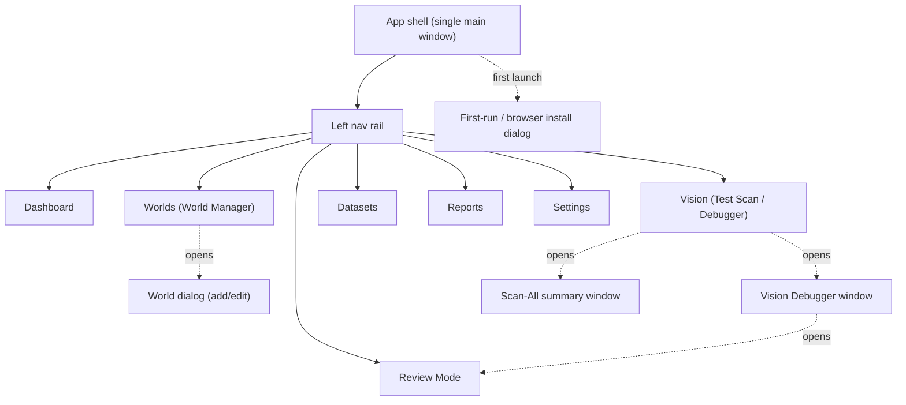

# Milestone 4.8 — Professional Desktop UI (specification)

**Presentation only.** This milestone redesigns how the app looks, not what it
does. Every existing feature, workflow, and behaviour is preserved; the Vision
pipeline, detector, classifier, OCR, weakening reader, runtime, scheduler, World
Manager, Review Mode, Active Learning, datasets, and training are untouched. This
is a spec — **no implementation yet**. Baseline to revert to: tag
`forge-m4-stable`.

The system stays **OBSERVE ONLY**: the restyle never adds an action control that
clicks, moves the cursor, types, or drives the game. The permanent "OBSERVE ONLY —
NO CLICK PERFORMED" status remains visible.

---

## 1. Design goals

1. Look like a purpose-built, professional fantasy-strategy companion tool.
2. Original visual language — **no Forge of Empires fonts, icons, textures,
   layouts, logos, or artwork.** All ornament is original or generated
   programmatically (gradients, procedural noise, SVG paths, QSS).
3. Modern desktop usability first: legible, high-contrast, keyboard-friendly,
   theme-aware (parchment/light and dark-wood/dark).
4. One coherent system: shared palette, type scale, spacing, and widgets across
   every window.

## 2. Theme & mood

Original "arcane cartography" language — a scholar's desk of maps and instruments:

- **Parchment** — warm paper surfaces (procedural fibre noise, soft vignette).
- **Stone** — neutral panels and dividers (subtle brushed gradient).
- **Bronze** — metal trim, primary controls, framing rules.
- **Dark wood** — the dark theme's base and side rails.
- **Arcane blue** — sparing magical highlight for focus, selection, and the
  would-click marker (a cool glow against the warm base).

All textures are generated (QSS gradients + a tiny procedural noise overlay), so
nothing ships as a copied asset.

## 3. Colour palette

Semantic tokens (both themes). Swap these into one QSS variable sheet.

| token | light (parchment) | dark (wood) | use |
|---|---|---|---|
| `--bg` | `#E9DEC6` | `#221A12` | app background |
| `--surface` | `#F3EAD6` | `#2C2318` | panels, cards |
| `--surface-2` | `#E2D4B6` | `#372B1D` | raised rows, headers |
| `--ink` | `#2A2016` | `#EBDBBB` | primary text |
| `--ink-muted` | `#6B5E49` | `#A5926E` | secondary text |
| `--line` | `#C9B78F` | `#4A3B27` | borders, dividers |
| `--bronze` | `#9A7A45` | `#B99154` | metal trim, primary button |
| `--bronze-hi` | `#C9A667` | `#D8B87A` | hover/edge highlight |
| `--arcane` | `#3E74B4` | `#5FA6E4` | focus, selection, CTA, would-click |
| `--arcane-glow` | `#7FC0FF` | `#8FD0FF` | selection glow / marker ring |
| `--ok` (CONTINUE) | `#3F7D4E` | `#5EA96C` | success / CONTINUE |
| `--warn` (UNKNOWN) | `#B98A22` | `#D6A93A` | caution / UNKNOWN |
| `--danger` (STOP) | `#A9433A` | `#CE5B50` | stop / error / danger |

Overlay colours in the Vision canvas keep the current, already-validated meaning
(accepted = green, unknown % = amber, rejected candidate = thin red, selected =
arcane cyan cross, ROIs = green/cyan). **These are not changed** — only the chrome
around the canvas is restyled.

## 4. Typography

Open-source, bundled; original choice (not Forge's typeface). Graceful fallback to
system fonts if unavailable.

| role | family (recommendation) | fallback | size / weight |
|---|---|---|---|
| Display / window titles | Spectral (serif) | Georgia, serif | 20–24 / 600 |
| Section headers | Spectral SemiBold | serif | 15–16 / 600 |
| Body / controls | Inter (humanist sans) | Segoe UI, system-ui | 13–14 / 400–500 |
| Table / data | Inter | system-ui | 12–13 / 400 |
| Vision explanation / JSON | JetBrains Mono | Consolas, monospace | 12–13 / 400 |

Type scale (pt): 24 / 20 / 16 / 14 / 13 / 12. Line-height ~1.4. Never below 12pt.

## 5. Iconography

Original **line icons**, 24×24 grid, 1.75px bronze stroke, round caps/joins, drawn
as inline SVG paths (no raster assets, no third-party icon set). Motif vocabulary
(all original glyphs): shield (World), crossbow-in-ring (badge/vision), scroll
(report), eye (observe/scan), anvil (dataset), gear (settings), compass
(dashboard), quill (review/label), stack (batch). Two-tone allowed: bronze stroke +
arcane accent dot for "active".

## 6. Spacing, grid, radius

- 8px base grid; spacing tokens 4 / 8 / 12 / 16 / 24 / 32.
- Window padding 16; card padding 16; row height 32 (tables) / 40 (list cards).
- Corner radius: 6 (controls), 10 (cards/panels), 2 (inline chips).
- Panel elevation: 1px `--line` border + soft 8px shadow (dark) / inset highlight
  (light). Bronze 1px top rule on cards for the "metal trim" read.

## 7. Reusable widgets (component library)

```
Button (primary)      [▉ Scan & Reattach ]   bronze fill, ink-on-bronze, 6r
Button (secondary)    [  Open Offline…    ]   surface, --line border
Button (ghost/danger) [  Stop             ]   text-only / danger on hover
Chip / tag            ( cz8 )  ( 20% )        surface-2, 2r, 12pt
Status pill           ● CONTINUE  ● STOP      dot + label, semantic colour
Toggle / segmented    [ Live | Offline ]      segmented control
Card                  ┌─ title ─────── ⋮ ┐    bronze top-rule, 10r
Panel header          ▸ SECTION            uppercase, --ink-muted, 12pt/600
Field                 Label  [ input     ]   label above, 6r input
Table                 zebra rows, sticky header, right-aligned numerics
Toolbar               left actions · spacer · right actions
Banner (observe)      ▛ OBSERVE ONLY — NO CLICK PERFORMED ▟  persistent strip
Empty state           icon + one line + primary action
```

## 8. Status indicators

Consistent semantic pills everywhere a state is shown:

- Runtime: `● stopped` (muted) · `● running` (ok) · `● error` (danger).
- Browser: `○ closed` · `● open`.
- World attach: `● attached` (ok) · `○ not attached` (muted).
- Weakening gate: `● CONTINUE` (ok) · `● STOP` (danger) · `◐ UNKNOWN` (warn).
- Capture: `● ok` · `● FAILED` (danger).
- Persistent OBSERVE-ONLY strip in the footer of every window (never inside the
  Vision canvas — that rule from M4.6 stands).

## 9. Navigation & window hierarchy



The current app is already a single `QMainWindow` with tabs. 4.8 keeps a **single
main window** but replaces the tab bar with a **left navigation rail** (icons +
labels), which scales better to the added surfaces. Secondary windows (Vision
Debugger, Scan-All, dialogs) remain separate windows, restyled.

## 10. Application layout (main shell)

```
┌───────────────────────────────────────────────────────────────────────────┐
│  ⚜ Forge of Empires Assistant                     ◐ dark/light   ● running │  title bar
├────────────┬──────────────────────────────────────────────────────────────┤
│  NAV RAIL  │  CONTENT AREA (selected section)                              │
│            │                                                               │
│ ⬡ Dashboard│   ┌───────────────────────────────────────────────────────┐  │
│ ⛨ Worlds   │   │  Section header + primary actions                     │  │
│ ⊕ Vision   │   │  ───────────────────────────────────────────────────  │  │
│ ✒ Review   │   │                                                       │  │
│ ⚒ Datasets │   │  (section body)                                       │  │
│ ⧉ Reports  │   │                                                       │  │
│ ⚙ Settings │   │                                                       │  │
│            │   └───────────────────────────────────────────────────────┘  │
├────────────┴──────────────────────────────────────────────────────────────┤
│ ▛ OBSERVE ONLY — NO CLICK PERFORMED ▟        Browser ● open   Worlds 2/2    │  status footer
└───────────────────────────────────────────────────────────────────────────┘
```

Nav rail: 220px, dark-wood rail with bronze active indicator; collapses to icons
at narrow widths. The runtime controls (Start / Stop / Tick once) live in the
Dashboard header and the footer, exactly as today — relabelled, not removed.

## 11. Surface wireframes

### 11.1 Dashboard

```
┌ Dashboard ───────────────────────────────  [Start] [Stop] [Tick once] ─────┐
│ ┌ Runtime ─────┐ ┌ Browser ────┐ ┌ Worlds ─────┐ ┌ Safety ───────────────┐ │
│ │ ● running    │ │ ● open      │ │ 2 attached  │ │ OBSERVE ONLY          │ │
│ │ last tick 3s │ │ 4 tabs      │ │ of 2        │ │ 0 clicks performed    │ │
│ └──────────────┘ └─────────────┘ └─────────────┘ └───────────────────────┘ │
│ ┌ Activity ───────────────────────────────────────────────────────────────┐│
│ │ World │ Status │ Last tick │ Rules │ Actions │ Health │ Error │ Timing   ││  (existing monitor table)
│ │ cz8 H │ ● ok   │ 3s        │ 0     │ 0       │ ●      │  —    │ 42ms     ││
│ └──────────────────────────────────────────────────────────────────────────┘│
│ ┌ Resource dashboard (when metrics available) ── memory / pages sparklines ─┐│  (existing DashboardWidget)
│ └──────────────────────────────────────────────────────────────────────────┘│
└──────────────────────────────────────────────────────────────────────────────┘
```

Preserves: Start/Stop/Tick, the monitor/activity table (World-not-Profile
columns), and the optional analytics `DashboardWidget`.

### 11.2 Worlds — World Manager (world cards)

Replaces the flat table with a **card grid** (the table remains available as a
"compact" toggle for parity). Each card = one World.

```
┌ Worlds ──────────────────  [+ Add World]  [Open Browser] [Scan & Reattach] ─┐
│ Hint: open the browser, log in to your worlds, then Scan & Reattach.        │
│ ┌ World card ───────────────────────┐ ┌ World card ───────────────────────┐ │
│ │ ⛨ H            ● attached   ⋮      │ │ ⛨ Farm          ○ not attached ⋮  │ │
│ │ cz8.forgeofempires.com            │ │ cz1.forgeofempires.com            │ │
│ │ interval 2000ms · limit 50        │ │ interval 2000ms · limit 50        │ │
│ │ allowed  (20)(40)                 │ │ allowed  (20)(40)(60)             │ │
│ │ tab ▾ [ cz8 | Main — https://… ]  │ │ tab ▾ [ — select tab —         ]  │ │
│ │ [ Test Scan ] [ Edit ] [ Remove ] │ │ [ Test Scan ] [ Edit ] [ Remove ] │ │
│ └───────────────────────────────────┘ └───────────────────────────────────┘ │
└──────────────────────────────────────────────────────────────────────────────┘
```

Preserves every World-Manager action: Add / Edit / Remove (hot CRUD), Open/Close
Browser, Scan & Reattach, per-World tab picker + attach status, hostname
reattach, and the exit-prompt behaviour. The `⋮` menu holds Close Browser and
per-World overflow. Start-gating (all worlds attached) drives the Dashboard's
Start button state, unchanged.

### 11.3 Vision — Test Scan launcher

```
┌ Vision ────────────────────────────────────────────────────────────────────┐
│ Test Scan World: [ H ▾ ]          Target                                     │
│                                    Alias: H                                  │
│ [ ⊙ Test Scan Live ] (attached)    Hostname: cz8.forgeofempires.com          │
│ [ ⭯ Open Offline Screenshot… ]     Tab: cz8 | Main                           │
│ [ ⛁ Scan All Attached Worlds ]     URL: https://cz8…/game/index              │
│                                                                              │
│ Real clicking stays disabled until you confirm these detections.            │
└──────────────────────────────────────────────────────────────────────────────┘
```

Preserves the M4.5 routing exactly: explicit World selector, target panel shown
before capture, Live (attached-only) vs Open-Offline split (no implicit file
picker), and Scan All. Opens the Vision Debugger / Scan-All windows below.

### 11.4 Vision Debugger window

```
┌ Vision Debugger — H (live) ─────────────────────────────────── ◐ ─────────┐
│ ┌ Canvas (annotated capture) ───────────────┐ ┌ Explanation ─────────────┐ │
│ │                                            │ │ World: H                 │ │
│ │   [ battle-map ROI, badges, weakening ROI, │ │ Map ROI: …               │ │
│ │     cyan would-click cross — UNCHANGED ]   │ │ Pipeline: stage-1 … acc… │ │
│ │                                            │ │ Detected: 20%  60%  ?    │ │
│ │   (no banner painted on the image)         │ │ Selected: 20% …          │ │
│ │                                            │ │ Would click: x=… y=…     │ │
│ └────────────────────────────────────────────┘ │ (monospace, scrollable)  │ │
│                                                 └──────────────────────────┘ │
│ [ Save artifacts… ]   [ ✒ Label in Review Mode… ]                            │
├──────────────────────────────────────────────────────────────────────────────┤
│ ▛ OBSERVE ONLY — NO CLICK PERFORMED ▟    Real clicking stays disabled.        │
└──────────────────────────────────────────────────────────────────────────────┘
```

Preserves everything from M4.4–4.6: the annotated canvas (with the exact overlay
semantics), the monospace explanation panel with pipeline counts, Save artifacts,
and Label-in-Review-Mode. The OBSERVE-ONLY strip stays in chrome (title + footer),
never on the image.

### 11.5 Scan-All summary window

```
┌ Scan All Worlds ─── OBSERVE ONLY ── each World scanned independently ───────┐
│ Alias │ Hostname            │ Capture │ Weak │ Decision │ Stage-1 │ Acc │ … │ Open │
│ H     │ cz8.forgeofempires… │ ● ok    │ 16   │ ◐ CONT.  │ 96      │ 2   │ … │ [↗]  │
│ F     │ cz6.forgeofempires… │ ● ok    │ 65   │ ◐ CONT.  │ 87      │ 2   │ … │ [↗]  │
│ Diagnostic only. No World's result depends on another's.                    │
└──────────────────────────────────────────────────────────────────────────────┘
```

Preserves the per-World independent summary + per-row "Open result" (↗) button
and the per-World artifact directories.

### 11.6 Review Mode

```
┌ Review Mode — OBSERVE ONLY ────────────────────────────────────────────────┐
│ ┌ Canvas (frame + editable badges + ROIs) ──┐ ┌ Side panel ───────────────┐ │
│ │  left-click add · right-click remove       │ │ [Run detector]            │ │
│ │  1-5 → 20/40/60/80/100                      │ │ [Set Weakening Region]    │ │
│ │  cyan/green/amber overlays                  │ │ [Set Battle-Map Region]   │ │
│ │                                             │ │ Current weakening         │ │
│ │                                             │ │  raw [▩] processed [▩]     │ │
│ │                                             │ │  detected / conf / limit  │ │
│ │                                             │ │  decision ● CONTINUE      │ │
│ │                                             │ │  ground truth [   ]       │ │
│ └─────────────────────────────────────────────┘ └───────────────────────────┘ │
│ ← Prev   [ 12 / 50 ]  Next →     Badges 3 · reviewed 41/50                    │
└──────────────────────────────────────────────────────────────────────────────┘
```

Preserves the full Review-Mode workflow: badge add/move/remove, keys 1–5, Run
detector overlay, Set Weakening / Set Battle-Map region, weakening raw/processed
crops + reader + fail-safe decision, ground-truth entry, frame nav, autosave.

### 11.7 Datasets manager (new *view* over existing data — no data changes)

A read-mostly browser over the already-committed datasets (grading, live_review,
review_batch_002). It surfaces what exists; it does not alter labels or training.

```
┌ Datasets ──────────────────────────────────────────────────────────────────┐
│ Source            │ Frames │ Badges │ Negatives │ Calibrated res │ Actions   │
│ grading           │ 15     │ 32     │ 0         │ 1920×1080      │ [Review]  │
│ live_review       │ 3      │ 6      │ 0         │ 1920×912, 1600×900 │ [Review] │
│ review_batch_002  │ 50     │ 124    │ 6         │ 1920×1080      │ [Review]  │
│ combined (deduped)│ 66     │ 156    │ 6         │ —              │ [Evaluate]│
│ Class coverage: 20 ▣▣▣▣  40 ▣  60 ▣▣  80 (none)  100 ▣                       │
└──────────────────────────────────────────────────────────────────────────────┘
```

"Review" opens Review Mode on that source; "Evaluate" runs the existing
`live_eval` and shows the report (§11.8). Read-only; no retraining is triggered
from the UI in this milestone.

### 11.8 Reports

Renders the existing markdown/JSON reports (`RETRAIN_REPORT.md`,
`DETECTOR_DIAGNOSIS.md`, `LIVE_VISION_REPORT.md`, `ACTIVE_LEARNING_PERF.md`,
`scan.json`) in a styled reader with a left index and metric cards.

```
┌ Reports ───────────────────────────────────────────────────────────────────┐
│ Index            │  Retrain report                                          │
│ • Retrain        │  ┌ P 0.66 ┐ ┌ R 0.86 ┐ ┌ F1 0.75 ┐ ┌ wrong-acc 0 ┐        │
│ • Detector diag  │  └────────┘ └────────┘ └─────────┘ └─────────────┘        │
│ • Live vision    │  (rendered markdown body, tables, annotated example imgs) │
│ • Active-learning│                                                          │
└──────────────────────────────────────────────────────────────────────────────┘
```

### 11.9 Settings

Groups existing configuration (theme, data/calibration paths, resource-monitor
limits, capture timeout). No new behaviour — surfaces what is configured today.

```
┌ Settings ──────────────────────────────────────────────────────────────────┐
│ Appearance   ◐ Theme [ System | Light | Dark ]   Density [ Comfortable ▾ ]  │
│ Paths        Data dir […]   Calibration […]   Datasets […]                  │
│ Capture      Timeout [ 20s ]   Read-only ✓ (locked — observe-only)          │
│ Resources    Max memory […]   Max pages […]                                 │
│ About        Version · tag forge-m4-stable · OBSERVE ONLY                    │
└──────────────────────────────────────────────────────────────────────────────┘
```

### 11.10 Dialogs

- **World dialog (add/edit)** — restyled `WorldDialog`: alias, host (with
  scanned-tab prefill), interval, max_weakening, allowed-% chips; inline
  validation ("not a Forge server"). Same fields and validation as today.
- **First-run / browser-install dialog** — restyled onboarding: Chromium check +
  install progress, then World-Manager handoff. Same flow.
- **Confirm-remove / exit prompt** — restyled message dialogs; keep-browser-open
  default preserved.

## 12. Feature-preservation matrix (nothing removed)

| Existing surface / behaviour | New home | Behaviour |
|---|---|---|
| Start / Stop / Tick once | Dashboard header + footer | unchanged |
| Monitor/activity table (World columns) | Dashboard | unchanged |
| Resource `DashboardWidget` | Dashboard (when metrics present) | unchanged |
| Open / Close Browser, Scan & Reattach | Worlds toolbar + card `⋮` | unchanged |
| World CRUD (hot add/edit/remove) | Worlds cards + World dialog | unchanged |
| Per-World tab picker + attach status | World card | unchanged |
| Hostname reattach, start-gating | (logic) | unchanged |
| Exit prompt (keep browser open) | restyled dialog | unchanged |
| Test Scan World selector + target panel | Vision launcher | unchanged |
| Test Scan Live / Open Offline / Scan All | Vision launcher | unchanged |
| Vision Debugger canvas + explanation + Save + Label | Debugger window | unchanged |
| Scan-All summary + Open result + artifacts | Scan-All window | unchanged |
| Review Mode (badges, keys 1-5, ROIs, weakening, nav) | Review section | unchanged |
| Calibration (Set Weakening / Battle-Map) | Review side panel | unchanged |
| Reports / diagnostics | Reports section | unchanged |
| Datasets (grading/live/batch) | Datasets section (read-only view) | unchanged |
| OBSERVE-ONLY guarantees | chrome banner + footer everywhere | unchanged |

## 13. Theming implementation notes (for the later build — not this milestone)

- One QSS variable sheet keyed to the tokens in §3; a `ThemeManager` swaps
  light/dark and stamps a `data-theme` equivalent property. No per-widget colours.
- Textures generated at runtime (QLinearGradient + a small tiled procedural-noise
  QPixmap painted once), so **no image assets are shipped**.
- Icons are inline SVG path strings rendered to `QIcon` at load — original glyphs.
- Fonts bundled under `assets/fonts/` (open-source) with system fallbacks; if
  absent, the app uses system fonts and still themes correctly.
- Restyle is confined to `src/bap/gui/`; no `src/bap/forge/` or `core/` change.

## 14. Accessibility & usability

- Minimum 12pt text; WCAG-AA contrast for text on every surface (both themes).
- Full keyboard navigation; visible arcane focus ring; existing Review-Mode
  shortcuts (1–5, ←/→) preserved.
- Colour is never the only signal — pills pair a dot with a text label; overlays
  keep their labels.
- Offscreen/headless rendering (`QT_QPA_PLATFORM=offscreen`) must keep working for
  the test suite.

## 15. Reversibility

This milestone adds documentation only. Implementation (a later, separately
approved step) will be confined to `src/bap/gui/`. At any point,
`git checkout forge-m4-stable` restores the fully validated Vision baseline with
zero loss of Vision work. If the visual direction is rejected, only presentation
code is discarded.

---

*No code is written in this milestone. Deliverable: this specification + the
`forge-m4-stable` tag + `RELEASE_BASELINE.md`.*
