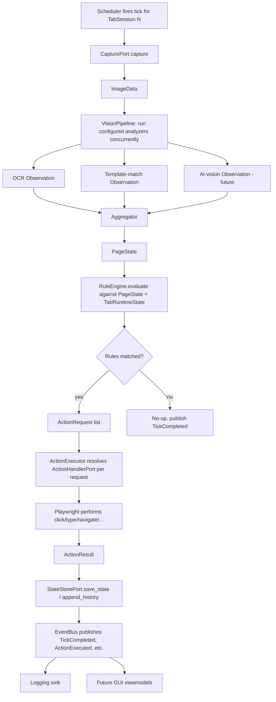
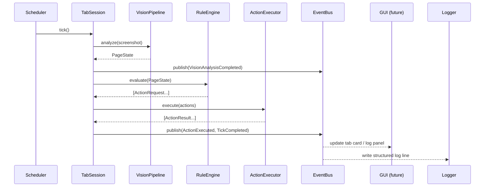
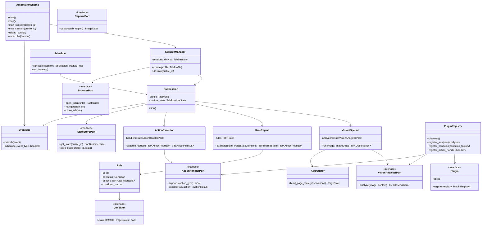

# Browser Automation Platform — Architecture Design

Status: design only, no implementation yet.
Scope: a generic, site-agnostic, local Windows desktop application for visually-driven
browser automation across many independent tabs.

This document intentionally avoids code. It defines structure, contracts, data flow and
the reasoning behind each decision so implementation can start from a stable skeleton.

---

## 1. Architectural style

**Hexagonal architecture (Ports & Adapters) with a small domain core**, organized in four
concentric layers:

```
                ┌───────────────────────────────────────────────┐
                │  Presentation (GUI / CLI)                      │
                │  PySide6 window, tray app, headless CLI         │
                └───────────────────────┬───────────────────────┘
                                        │ calls facade / subscribes to events
                ┌───────────────────────▼───────────────────────┐
                │  Application layer                             │
                │  AutomationEngine, SessionManager, Scheduler    │
                └───────────────────────┬───────────────────────┘
                                        │ uses ports (interfaces)
                ┌───────────────────────▼───────────────────────┐
                │  Domain core (framework-agnostic)               │
                │  PageState, Rule/Condition, ActionRequest,      │
                │  VisionPipeline, RuleEngine, ActionExecutor     │
                └───────────────────────┬───────────────────────┘
                                        │ implemented by
                ┌───────────────────────▼───────────────────────┐
                │  Adapters / Infrastructure                      │
                │  Playwright browser adapter, OCR adapter,       │
                │  OpenCV template matcher, AI-vision adapter,    │
                │  SQLite state store, log sinks                 │
                └───────────────────────┬───────────────────────┘
                                        │ discovered/extended by
                ┌───────────────────────▼───────────────────────┐
                │  Plugins (3rd-party / user-defined)             │
                │  custom analyzers, rule conditions, actions     │
                └───────────────────────────────────────────────┘
```

Why hexagonal: the whole point of the platform is that **vision, rules, and browser
control must vary independently** (new AI vision backend, new rule DSL, swap Playwright
for something else) without touching the others. Ports are the contract that makes that
possible; the domain core never imports Playwright, PySide6, Tesseract, or OpenCV
directly — only their port interfaces.

Supporting patterns layered on top: DDD-style domain modeling for the core, CQRS-ish
split between **commands** (start/stop/update — imperative, go through the engine
facade) and **events** (state changes — flow out through a pub/sub bus), and a plugin
registry for extensibility. Each is detailed in §7.

---

## 2. Project folder structure

```
browser_automation_platform/
├── pyproject.toml
├── README.md
├── config/
│   ├── app.config.yaml            # global settings (logging, capture defaults, plugin dirs)
│   ├── profiles/                  # one file per tab/session
│   │   ├── profile_01.yaml
│   │   └── profile_02.yaml
│   ├── rules/                     # reusable rule packs, referenced by profiles
│   │   └── example_rulepack.yaml
│   └── schema/                    # exported JSON Schema for validation + future GUI forms
│
├── src/
│   └── bap/                       # "Browser Automation Platform" — top-level package
│       ├── main.py                # composition root: builds adapters, wires ports, starts engine
│       ├── cli.py                 # headless entrypoint (no GUI)
│       │
│       ├── core/                              # ── domain layer, no 3rd-party framework imports ──
│       │   ├── domain/
│       │   │   ├── models.py       # PageState, Observation, ActionRequest, TabProfile, Rect, etc.
│       │   │   └── enums.py        # ActionType, ObservationKind, SessionStatus...
│       │   ├── ports/               # abstract interfaces (Protocol/ABC) — the seams
│       │   │   ├── browser_port.py
│       │   │   ├── capture_port.py
│       │   │   ├── vision_analyzer_port.py
│       │   │   ├── action_handler_port.py
│       │   │   ├── state_store_port.py
│       │   │   └── notifier_port.py
│       │   ├── engine/
│       │   │   ├── automation_engine.py   # public facade used by GUI/CLI
│       │   │   ├── session_manager.py     # owns the collection of TabSessions
│       │   │   ├── tab_session.py         # per-tab tick loop (template method)
│       │   │   └── scheduler.py           # drives tick cadence per tab
│       │   ├── vision/
│       │   │   ├── pipeline.py            # runs configured analyzers, collects Observations
│       │   │   └── aggregator.py          # merges Observations into a PageState
│       │   ├── rules/
│       │   │   ├── rule_engine.py
│       │   │   ├── conditions.py          # built-in condition types (Strategy)
│       │   │   └── rule_loader.py         # config → Rule object graph
│       │   ├── actions/
│       │   │   ├── action_executor.py
│       │   │   └── handlers.py            # built-in action handlers (Strategy)
│       │   └── events/
│       │       ├── event_bus.py
│       │       └── events.py              # event dataclasses (see §6)
│       │
│       ├── adapters/                           # ── concrete implementations of ports ──
│       │   ├── browser/
│       │   │   └── playwright_adapter.py        # BrowserPort impl (async Playwright API)
│       │   ├── capture/
│       │   │   └── playwright_capture.py        # CapturePort: full-page / element / region
│       │   ├── vision/
│       │   │   ├── ocr_tesseract.py              # VisionAnalyzerPort
│       │   │   ├── template_match_opencv.py      # VisionAnalyzerPort
│       │   │   └── ai_vision_adapter.py          # VisionAnalyzerPort (future, stubbed first)
│       │   ├── actions/
│       │   │   └── playwright_action_handlers.py # click/type/scroll/navigate/key
│       │   ├── state/
│       │   │   └── sqlite_state_store.py         # StateStorePort
│       │   └── notify/
│       │       └── desktop_toast_notifier.py      # NotifierPort
│       │
│       ├── plugins/
│       │   ├── plugin_api.py         # base classes/protocols exposed to 3rd-party plugins
│       │   ├── plugin_registry.py    # discovery (entry_points) + loading + sandboxing
│       │   └── examples/             # sample plugin, not auto-loaded
│       │
│       ├── config/
│       │   ├── config_models.py      # pydantic models: AppConfig, ProfileConfig, RuleConfig...
│       │   ├── config_loader.py      # load/merge/validate YAML → models
│       │   └── config_watcher.py     # optional hot-reload of rules/profiles
│       │
│       ├── logging_/
│       │   ├── logging_setup.py      # structured logging configuration
│       │   └── log_sinks.py          # file, console, in-memory ring buffer (for GUI console)
│       │
│       └── gui/                                # ── future, PySide6 ──
│           ├── main_window.py
│           ├── viewmodels/            # translate engine events → Qt models/signals
│           └── widgets/               # tab grid, rule editor, log viewer
│
├── plugins_external/               # user-installed drop-in plugins, outside the package
├── tests/
│   ├── unit/
│   ├── integration/
│   └── fakes/                      # fake adapters implementing the ports, for testing
└── logs/
```

Note: `logging_` (trailing underscore) to avoid shadowing the stdlib `logging` module on
`sys.path`.

---

## 3. Module responsibilities

| Module | Responsibility | Depends on |
|---|---|---|
| `core/domain` | Pure data model: `PageState`, `Observation`, `ActionRequest`, `TabProfile`, value objects (`Rect`, `Point`). No behavior beyond validation. | nothing |
| `core/ports` | Interface definitions only (`Protocol`/`ABC`). Define the vocabulary every adapter must speak. | `core/domain` |
| `core/engine/automation_engine` | Single public facade. Exposes `start()`, `stop()`, `start_session(profile_id)`, `stop_session(profile_id)`, `reload_config()`, `subscribe(handler)`. Everything outside `core` talks to the system through this. | `session_manager`, `event_bus`, `config` |
| `core/engine/session_manager` | Owns the set of `TabSession` instances; creates/destroys them from `ProfileConfig`; enforces the max-concurrent-tabs limit. | `tab_session`, `ports/browser_port` |
| `core/engine/tab_session` | One tab's lifecycle and tick loop: capture → analyze → evaluate → act → persist state → publish events. Template Method: the skeleton is fixed, each step is delegated to an injected port/service. | `vision/pipeline`, `rules/rule_engine`, `actions/action_executor`, `ports/state_store_port` |
| `core/engine/scheduler` | Decides *when* each `TabSession` ticks (independent interval per profile, jitter to avoid thundering herd, backoff on repeated errors). | `asyncio` only |
| `core/vision/pipeline` | Runs the configured list of `VisionAnalyzerPort` implementations against a captured image, collects `Observation` objects. Analyzers run concurrently in a worker pool since OCR/template-matching are CPU-bound. | `ports/vision_analyzer_port` |
| `core/vision/aggregator` | Merges raw `Observation`s (possibly conflicting, multiple analyzers touching the same region) into one `PageState` keyed by logical field name. | `domain/models` |
| `core/rules/rule_engine` | Evaluates a profile's configured `Rule` tree against the current `PageState` (+ session history for stateful rules like counters/cooldowns). Produces zero or more `ActionRequest`s. | `domain/models`, `rules/conditions` |
| `core/rules/conditions` | Built-in condition types (`equals`, `contains`, `greater_than`, `region_changed`, `matched_template`, `AND`/`OR`/`NOT` composites). Strategy pattern; plugins add more. | `domain/models` |
| `core/actions/action_executor` | Takes `ActionRequest`s from the rule engine, resolves each to a registered `ActionHandlerPort`, executes, records `ActionResult`. Applies throttling/cooldown per action if configured. | `ports/action_handler_port` |
| `core/actions/handlers` | Built-in handlers: click, type, key-press, scroll, navigate, wait, no-op/log-only. | `ports/action_handler_port` |
| `core/events/event_bus` | In-process pub/sub. Decouples GUI, logging, metrics from the engine internals. | nothing |
| `adapters/browser/playwright_adapter` | Implements `BrowserPort`: launches persistent browser, creates one `BrowserContext` (or one context per tab, configurable), opens/closes pages, exposes navigation. | Playwright |
| `adapters/capture/playwright_capture` | Implements `CapturePort`: screenshot of full page, a CSS-selector-bound element, or a pixel `Rect`. Returns a normalized `ImageData` (bytes + size + tab id + timestamp). | Playwright |
| `adapters/vision/*` | Implement `VisionAnalyzerPort` for OCR (Tesseract now, swappable), OpenCV template/feature matching, and a stub AI-vision analyzer (future). | pytesseract / opencv / (future) model client |
| `adapters/actions/playwright_action_handlers` | Implement `ActionHandlerPort` using Playwright's input APIs (`click`, `fill`, `press`, `mouse.move`, `evaluate`). | Playwright |
| `adapters/state/sqlite_state_store` | Implements `StateStorePort`: per-tab last state, counters, history for rule cooldowns and for future replay/debugging. | sqlite3 |
| `plugins/plugin_registry` | Discovers plugins via `importlib.metadata` entry points (installed packages) and via `plugins_external/` (drop-in scripts). Validates plugin manifest, registers analyzers/conditions/handlers into the core registries. | `plugin_api` |
| `config/*` | Load, validate (pydantic), merge (global defaults + per-profile overrides), and hot-reload YAML configuration. Exports JSON Schema for future GUI-driven rule/profile editors. | pydantic, yaml |
| `logging_/*` | Structured logging: one logger per tab with `tab_id`/`tick_id` context, rotating file sinks, console sink, and an in-memory ring-buffer sink the future GUI can read without touching files. | stdlib `logging` (or `structlog`) |
| `gui/*` (future) | PySide6 shell. Talks only to `AutomationEngine` (commands) and `EventBus` (subscriptions). Never imports Playwright, OpenCV, or adapters directly. | PySide6, `core` facade |

---

## 4. Interfaces between modules (ports)

These are the contracts, described conceptually (signatures, not code):

- **`BrowserPort`**
  `launch(options) -> BrowserHandle`
  `open_tab(profile: TabProfile) -> TabHandle`
  `navigate(tab: TabHandle, url: str) -> None`
  `close_tab(tab: TabHandle) -> None`
  `get_dom_snapshot(tab: TabHandle, selector: str | None) -> DomSnapshot` *(optional, for non-visual signals)*

- **`CapturePort`**
  `capture(tab: TabHandle, region: Rect | Selector | None) -> ImageData`

- **`VisionAnalyzerPort`** *(Strategy — many implementations, same shape)*
  `name -> str`
  `analyze(image: ImageData, context: AnalyzerContext) -> list[Observation]`

- **`ActionHandlerPort`** *(Strategy)*
  `supports(action_type: ActionType) -> bool`
  `execute(tab: TabHandle, action: ActionRequest) -> ActionResult`

- **`StateStorePort`**
  `get_state(profile_id) -> TabRuntimeState`
  `save_state(profile_id, state: TabRuntimeState) -> None`
  `append_history(profile_id, event: HistoryEntry) -> None`

- **`NotifierPort`**
  `notify(event: DomainEvent) -> None` *(desktop toast, sound, webhook — future)*

- **`Plugin`** (see §8)
  `id`, `version`, `description`
  `register(registry: PluginRegistry) -> None` — the plugin's one entry point; it adds
  its analyzers/conditions/action handlers into the registry, it never reaches into the
  engine directly.

The **domain core depends only on these ports**, never on concrete adapters. `main.py`
(composition root) is the only place concrete adapters get instantiated and injected.

---

## 5. Data flow (one tick, one tab)



Each tab runs this loop independently and concurrently; the Scheduler staggers ticks so
8+ tabs don't all capture/analyze in the same instant (avoids CPU spikes and keeps
screenshots from serializing behind a single worker pool bottleneck).

---

## 6. Event flow

All cross-cutting communication (GUI updates, logging, metrics, future notifications)
happens through the `EventBus`, not direct calls. Event types:

| Event | Published when | Consumers |
|---|---|---|
| `SessionStarted` / `SessionStopped` | a tab's session starts/stops | GUI, logging |
| `TickStarted` / `TickCompleted` | each loop iteration begins/ends | GUI (live status), metrics |
| `CaptureCompleted` | screenshot taken | GUI (thumbnail preview), debug recorder |
| `VisionAnalysisCompleted` | all analyzers finished, `PageState` built | GUI (overlay), logging |
| `RuleEvaluated` | each rule checked (matched or not) | debug/trace view |
| `ActionExecuted` | an action ran | GUI, logging, notifier |
| `ErrorOccurred` | any exception in the tick pipeline | logging, GUI alert, notifier |
| `ConfigChanged` | config reloaded (hot-reload) | SessionManager (re-applies), GUI |
| `PluginLoaded` / `PluginError` | at startup / plugin discovery | logging, GUI plugin panel |



The GUI is a pure subscriber for state; it issues **commands** (start/stop/update) back
through `AutomationEngine`, never mutates engine state directly. This keeps the future
PySide6 app from ever needing to know about Playwright, OpenCV, or threading details.

---

## 7. Recommended design patterns

| Pattern | Where | Why |
|---|---|---|
| **Ports & Adapters (Hexagonal)** | whole system | Isolates domain (vision/rules/actions) from Playwright, PySide6, Tesseract, OpenCV so any of them can be swapped. |
| **Strategy** | `VisionAnalyzerPort` impls, `ActionHandlerPort` impls, rule `Condition` types | Interchangeable algorithms behind one interface; new analyzer/condition/action = new class, zero changes elsewhere. |
| **Template Method** | `TabSession` tick loop | Fixed skeleton (capture→analyze→evaluate→act→persist→publish), steps delegated to injected collaborators. |
| **Observer / Pub-Sub** | `EventBus` | Decouples engine internals from GUI, logging, notifications. |
| **Command** | `ActionRequest` objects | Actions are data, queued/throttled/logged/replayed uniformly instead of being direct method calls. |
| **Facade** | `AutomationEngine` | One entry point for GUI/CLI; hides SessionManager/Scheduler/EventBus wiring. |
| **Registry / Plugin** | `PluginRegistry` | Runtime discovery and registration of 3rd-party analyzers/conditions/handlers via entry points. |
| **Factory** | profile → `TabSession` construction; config → `Rule`/`Condition` object graph | Centralizes object construction that depends on config content. |
| **Repository** | `StateStorePort` | Persistence abstracted from the domain; SQLite today, swappable later (e.g. a shared DB if the app becomes multi-machine). |
| **Dependency Injection (constructor-based, no framework needed)** | `main.py` composition root | Enables testing the domain core with fake adapters (`tests/fakes`) with no Playwright/GUI involved. |
| **Chain of Responsibility (optional)** | rule evaluation with short-circuit groups, or a vision pipeline where analyzers can veto/skip downstream ones | Useful once rule packs grow large; not required for v1. |

---

## 8. Configuration format

YAML, validated by pydantic models, split into three concerns so they can be edited and
versioned independently:

**`config/app.config.yaml`** — global settings:
```yaml
version: 1
logging:
  level: INFO
  file_sink: logs/app.log
  console_sink: true
capture:
  default_interval_ms: 500
  max_concurrent_tabs: 8
browser:
  engine: chromium
  headless: false
  isolate_contexts_per_tab: true   # one BrowserContext per tab vs. shared context
plugins:
  external_dir: plugins_external
  enabled:
    - my_company.custom_vision_plugin
```

**`config/profiles/profile_01.yaml`** — one per tab/session:
```yaml
id: profile_01
enabled: true
start_url: "https://example.com/"
capture_interval_ms: 500          # overrides global default
viewport: { width: 1920, height: 1080 }
capture_targets:
  - name: header_region
    type: rect
    rect: { x: 0, y: 0, w: 800, h: 120 }
  - name: main_panel
    type: selector
    selector: "#main-panel"
analyzers:
  - type: ocr
    target: header_region
    lang: eng
  - type: template_match
    target: main_panel
    template: templates/button_active.png
rule_pack: rules/example_rulepack.yaml
plugin_overrides:
  my_company.custom_vision_plugin:
    threshold: 0.82
```

**`config/rules/example_rulepack.yaml`** — reusable, referenced by any profile:
```yaml
id: example_rulepack
rules:
  - id: click_when_counter_low
    when:
      all:
        - field: header_region.ocr_text
          op: matches_regex
          value: "Count:\\s*(\\d+)"
        - field: header_region.ocr_number
          op: less_than
          value: 100
    cooldown_ms: 2000
    then:
      - action: click
        target: main_panel
      - action: log
        message: "counter below threshold, clicked"
  - id: stop_on_error_banner
    when:
      any:
        - field: main_panel.template_match
          op: equals
          value: "error_banner"
    then:
      - action: stop_session
```

Design intent:
- `app.config.yaml` = infrastructure defaults, rarely touched per-run.
- `profiles/*.yaml` = "what does this tab look at and how often" — one file per tab
  means adding tab 9, 10, ... is just dropping in another file, no code change.
- `rules/*.yaml` = "what should happen" — decoupled from profiles so the same rule pack
  can drive multiple tabs, and non-programmers can eventually edit these through a
  future GUI rule builder (the pydantic models double as the JSON Schema source for
  that editor).
- Every plugin ships its own config sub-schema; `plugin_overrides` is validated against
  it, not hardcoded into the core config models.

---

## 9. Class diagram (core)



---

## 10. Concurrency model

- Single Python process, **asyncio event loop**, using Playwright's **async API** (not
  sync) — this is what makes 8+ concurrently-driven tabs practical without a thread per
  tab.
- One `Browser` instance; **one `BrowserContext` per tab by default** (configurable) so
  cookies/storage/sessions stay isolated between tabs — matches "independent tabs"
  requirement. A shared-context mode is available for scenarios needing a common login.
- `Scheduler` staggers tick start times per profile (jitter) so N tabs don't all capture
  in the same event-loop turn.
- Vision analyzers (OCR, OpenCV) are CPU-bound and would block the event loop if run
  inline — they run in a `ThreadPoolExecutor`/`ProcessPoolExecutor` via
  `loop.run_in_executor`, keeping Playwright I/O responsive.
- Rule evaluation and action dispatch stay on the event loop (cheap, mostly comparisons
  and awaited Playwright calls).

---

## 11. Logging

- Standard library `logging` (or `structlog`) with **structured records**: every log
  line carries `profile_id`, `tick_id`, `component`. This is what lets you filter "show
  me tab 3's last 50 ticks" later.
- Sinks are pluggable: rotating file per profile + one combined file, console for dev,
  and an **in-memory ring buffer** sink that the future GUI reads directly (no file
  tailing needed for a live log panel).
- `ErrorOccurred` events (from the EventBus) are always logged at `ERROR` regardless of
  configured level, so failures in one tab are never silently swallowed.

---

## 12. Plugin system

Two supported plugin sources:
1. **Installed packages** — discovered via Python `entry_points` (a plugin is a normal
   pip-installable package declaring an entry point group, e.g.
   `bap.plugins`). This is the path for distributing plugins independently.
2. **Drop-in folder** (`plugins_external/`) — a single-file or single-folder plugin
   picked up at startup without packaging, for quick local experimentation.

A plugin implements the `Plugin` interface and, in its `register()` method, adds its own
`VisionAnalyzerPort`, `Condition`, and/or `ActionHandlerPort` implementations into the
`PluginRegistry`. The core never imports plugin code directly — it only iterates
registered instances. Plugins **cannot** reach into `TabSession`/`SessionManager`
internals; their surface is exactly the same ports the built-in adapters use, so a
plugin can't do anything a first-party adapter couldn't also do, which keeps the
security/reliability blast radius bounded.

Plugin manifest (metadata, not code) declares: `id`, `version`, `min_platform_version`,
`config_schema` (for the `plugin_overrides` block in profile YAML), and which
extension points it registers into (analyzer/condition/action).

---

## 13. Future extensibility

| Future need | How it slots in without breaking the core |
|---|---|
| **AI vision** (VLM-based screen understanding) | New `VisionAnalyzerPort` implementation (`ai_vision_adapter.py`) that sends the captured image + a prompt to a model and parses the response into the same `Observation` shape OCR/template-match already produce. `RuleEngine` doesn't know or care which analyzer produced a field. |
| **Better/alternate OCR** (PaddleOCR, EasyOCR, cloud OCR) | Swap/add another `VisionAnalyzerPort` implementation; select per-profile in config. |
| **PySide6 GUI** | Talks only to `AutomationEngine` (commands) + `EventBus` (subscriptions/viewmodels). Can run in the same process (asyncio + Qt via `qasync`) since the domain core has zero Qt dependency today. |
| **Remote/headless control** | The existing Flask/SocketIO pattern from the prototype could be repurposed as *one more adapter/consumer* of `AutomationEngine` + `EventBus` — a thin REST/WebSocket shell, not a redesign. |
| **Different browser engine** | New `BrowserPort`/`CapturePort`/`ActionHandlerPort` implementations (e.g. CDP-direct, or Selenium) — domain core unaffected. |
| **Rule builder UI / visual rule editor** | Rule and Condition pydantic models already export JSON Schema; a GUI form can be generated from that schema rather than hand-built. |
| **Session recording & replay** | `StateStorePort` + `EventBus` history already capture every tick; a "replay" mode is a new adapter that feeds recorded `ImageData`/`PageState` back through the same pipeline for debugging rules offline. |
| **Distributed / multi-machine** | `StateStorePort` swapped for a shared DB; `EventBus` swapped for a network-backed pub/sub (e.g. Redis) — both are ports already, not hardcoded. |
| **More than 8 tabs / scaling out** | `SessionManager` + `Scheduler` are the only places tab count is referenced; raising `max_concurrent_tabs` and adding profile files is enough at moderate scale, multi-process sharding is a later `SessionManager` variant if needed. |

---

## 14. What this design deliberately defers

No code, no dependency pinning, no concrete plugin API method signatures, no GUI
wireframes. These should follow once the port interfaces above are agreed on, since
every one of them is a boundary that's expensive to change later — everything behind a
boundary (which adapter, which vision library, which GUI toolkit binding details) is
cheap to change and shouldn't be over-designed now.
